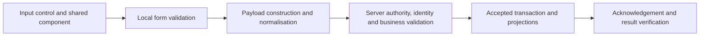

# iREPS Form Standards

Version **0.1** · **25 September 2026** · Academy-owned explanation and review standard.

Every form package has a Body of Knowledge, User Manual, Field Catalogue, Error Register and Practical Examples. This document explains their common conventions and starts the shared form standard requested by the owner. It does not silently approve every design proposal or replace the engineering rules.

The [master dictionary](../15-dictionary/iREPS_Master_Dictionary.md) owns business terminology. `ireps-rules` owns executable/prescriptive product rules; `ireps-schemas` owns technical schemas. Academy explains them and records discrepancies. The [source baseline](../00-academy-governance/FORMS_SOURCE_BASELINE_2026-09-25.csv) identifies the inspected revisions of AU-R001, UI-R003 and UI-R004.

## 1. Four evidence labels

| Label | Meaning | Example |
| --- | --- | --- |
| Owner direction | The owner has requested or confirmed the business meaning | Meter Discovery and Meter Installation are registration forms |
| Documented rule | A maintained rule prescribes the behaviour | UI-R004 requires readable form text to be black |
| Observed source | A named implementation contains this behaviour | A premise submission uses a 10-second timeout in its inspected source |
| Verified release | The behaviour has been demonstrated in a named environment/build | Must be supplied by an actual acceptance record; none is invented here |

Use **proposed standard** for recommendations below that need owner/design agreement. A screen existing in a branch is not a verified release. A successful save of documentation to GitHub is not application deployment.

## 2. Names mean one thing

Use **Meter Discovery**, **Meter Installation**, **Normal Path**, **Sales Path** and **Premise Picker** consistently. Use **Super User** for SPU; Guest is excluded from the current role catalogue. Do not introduce alternative path names for variety.

Use **Reconnect meter** for the shared reconnection instruction in the inspected UI-R003 revision. Preserve a verbatim runtime message or technical key where it is being quoted as evidence; identify the wording difference rather than pretending the application was renamed by editing a manual.

A field needs three distinct identifiers where applicable: the business term, the visible label and the storage key. Examples: a visible Business Name can bind to `propertyType.name`; a controlled label can store a different code; an Other input can be folded into another field's payload. The catalogue must explain these mappings.

## 3. Text and visual signals — documented UI-R004 rule

All readable form text is **black, `#000000`**, on mobile and web. This covers labels, entered and prefilled values, placeholder hints, Existing iREPS value text, ordinary helper text and section headings. The rule addresses outdoor readability and consistent presentation.

Errors remain red. Buttons retain their own colours. Green SAME, pink DELETE, DIFFERENT and disabled-control signals retain their meanings. For list and dashboard pages, the rule covers input/search boxes and their labels/hints; it does not automatically recolour every dashboard caption.

The rule prescribes central `src/theme/formColors.js` files and a `ci:verify-form-colours` check in each app. In this investigation those files were found in **ireps-mobile-forms** and **ireps-web-forms**, not in the primary mobile/web trees. This is a concrete branch-availability distinction: it must not be reported as a completed platform-wide rollout.

## 4. Input families

The following contracts are **proposed standards**, except where a specific documented rule is named. They are the basis for reviewing consistent components; they do not establish uninspected pixel dimensions or approved component variants.

| Input family | Proposed common behaviour | Catalogue requirements |
| --- | --- | --- |
| Text | Persistent label; visible value; explicit maximum/format only where defined; preserve meaningful identifiers | Name, description, text type, trimming/case transformation, length rules, example |
| Numeric observation | Show the measured quantity and unit; distinguish an unavailable observation from zero | Unit, precision, accepted numeric format, allowed range, exception reason, source of value |
| Identifier | Preserve leading zeros; validate the identity rule rather than treating the value as arithmetic | Normalisation, uniqueness scope, lookup behaviour, collision and correction handling |
| Controlled dropdown | Same question uses the same component, list and wording; no silent free-text substitution | Code/label mapping, list authority, allowed values, conditional Other behaviour |
| Record picker | Select an actual referenced person, premise, team or provider; explain unavailable choices | Reference type, scope/eligibility, loading failure, stale selection, server revalidation |
| Yes/no | Explain precisely what yes confirms; do not default missing evidence to a successful answer | Allowed values, initial value, notes/evidence dependencies, effect on other fields |
| Date/time | Distinguish observed time, business effective time and server receipt time | Time source, timezone, editability, required ordering, late submission handling |
| GPS/map | Distinguish device position, meter position, premise position and boundary | Coordinate type, confirmation, precision/proximity checks, location failure |
| Photograph/media | Explain what the image must prove, not only how many images to add | Tag, requirement condition, capture/upload state, association and recovery |
| Repeated group | Make each account/member/line item identifiable and explain add/remove behaviour | Minimum/maximum, duplicate checks, stable item identity, empty-group behaviour |
| File upload | Identify accepted content and validation results; upload is not acceptance | File schema/version, size/type, row errors, partial acceptance, retry identity |
| Read-only/inherited value | Show why it is fixed and where it comes from | Source reference, freshness, correction route, whether it is actually submitted |

The observed meter-number rule is specific: remove spaces, uppercase ASCII a–z, and accept only A–Z and digits. Other symbols are rejected rather than silently removed. This does not automatically apply to account numbers, supplier registration numbers, email addresses or user-entered notes.

## 5. Dropdown ownership — documented UI-R003 rule

Field-form option lists are local in the mobile `src/features/meters/formOptions.js` module. Forms should not fetch these lists from the server. The same question uses the same list, wording and component. Examples include meter kinds, phases, placements, status selections, anomalies and the shared office instruction lists.

This rule does not convert live references into static dropdowns. Selecting an active service provider at signup, choosing a team or selecting a premise still requires the relevant live record and scope checks. Search filters and administrative lookup editors are also not automatically the authoritative list for a field form.

Installation omits manufacturer Other because that form lacks a corresponding custom-make input. Inspection uses the shared choices for meter kind, phase, category and off-grid supply; keypad questions depend on prepaid kind. Disconnection levels and lower-reading reasons still have single-screen source locations in the inspected implementation. Do not claim those have already moved to the shared module.

Retired options may need to remain interpretable in historical records without being offered for new capture. Changing a displayed label must not silently change the meaning of a stored code. An administrative lookup edit needs a verified consumer before a trainer promises that it will appear on the phone.

## 6. Conditional fields and validation

**Proposed standard:** a field catalogue records what causes a field to appear, what it depends on, when it is required, what becomes invalid when a parent changes and how its value is transformed or cleared. Hiding a field is not proof that its old value is removed from the payload.

Validate at each layer independently:

Client validation improves feedback; it does not replace server checks. A numeric keyboard is not a numeric data type. A disabled option is not the complete permission model. A successful media upload is not the transaction commit. Every catalogue must distinguish blank, zero, false, unknown and not applicable; use NAv only according to the owning field's meaning and transformation.

Evidence conditions are part of validation. A photograph of a meter serial proves a different fact from a photograph of a breaker or a locked gate. A generic “photo attached” must not conceal a missing required tag or wrong subject.

## 7. Submission words and outcomes

The following vocabulary is a **proposed platform-wide standard**; current workflows differ:

| Term | Meaning to preserve |
| --- | --- |
| Save on this phone | A local draft/record was durably saved; it does not claim server acceptance |
| Submit | The person initiates a server-bound attempt |
| Uploading media | Evidence is being transferred; the form transaction may not yet exist |
| Accepted/submitted successfully | The relevant server result confirms the business transaction; verify its identifier and outcome |
| Completed work | The recorded physical/work outcome actually meets that task's completion rule |
| Pending/uncertain | The intended outcome is not yet reconciled; retain identity and evidence |

A valid unsuccessful commissioning form, a No Access visit and an unsuccessful reading can be meaningful accepted records without the intended physical result. Avoid one generic green success message that implies every business objective was achieved.

AU-R001 has specific authentication feedback rules: signup/reset/password-change confirmation before submission, visible progress during it and a result afterwards; Sign In omits routine confirmation and signals success by entering the application. This is an authentication rule, not evidence that every other form already uses the same dialogs.

## 8. Offline behaviour is not yet one standard implementation

The accepted direction is local-first storage for server-bound submissions, followed by transmission when connectivity permits. A 15-second attempt target is under discussion. A stopped wait is not cancellation of server processing, and retry must preserve/reconcile the original transaction identity.

Observed examples differ:

| Workflow | Source behaviour relevant to teaching | Consequence |
| --- | --- | --- |
| Premise Registration | Has local queue/edit paths and a 10-second submit timeout; successful queued item can be removed | Do not apply the proposed 15-second policy as an existing universal rule |
| Meter Installation | Explicit call site uses a 15-second wait; has local fallback and queue handling | An automatic-sync message still needs controller/release verification |
| Commissioning/disconnection/reconnection/removal/reading | Individual queue and timeout paths exist; successful queued item removal appears in these screens | Behaviour must be validated per workflow, not inferred for all forms |
| Meter Inspection | SAVE and SUBMIT differ; some offline cases require an explicit SAVE; successful queued record is marked SUCCESS | Do not tell users every attempt is automatically saved or deleted |
| Account Data | Uses a separate Data Cleansing queue and network fallback | Show its own recovery location and outcome |

Local deletion/retention, automatic retry, late acknowledgement, device loss and storage exhaustion remain open design questions. No new retry or deletion mechanism was implemented by the Academy task.

## 9. Errors and partial success

Every module needs an error register that records code where available, exact message/template, trigger, stage, data state, remedy and escalation evidence. An Academy reference ID is never a fabricated runtime error code.

The new extracted registers also include source notifications encountered alongside errors. These must be classified during review; success notifications are not failures. A dynamic resolver expression needs its shared message map, and the same code can mean different things at different stages.

A password can change even if the user-record acknowledgement fails. A server transaction can succeed after the phone times out. A report can be generated without being delivered. Remedies must follow the actual partial state rather than telling the user to repeat every step blindly.

## 10. Corrections, QA and authority

The owner requires trustworthy submitted evidence because downstream payments and invoices depend on it. Current inspection updates to an asset projection are not permission to edit an earlier submitted transaction. Future QA rejection and correction design must preserve history and define financial consequences.

Permission checks are action-specific. A user’s role, provider layer, workbase, assignment, batch ownership and current workflow state can all matter. No blanket higher-role inheritance claim belongs in a form guide until agreed and verified.

## 11. Review and acceptance checklist

For each form, review one ordinary case, every material conditional branch, wrong context, missing evidence, permission refusal, stale state, No Access where relevant, timeout, duplicate retry and partial success. Record the named mobile/web/backend revisions, expected persisted records and observed outcomes.

The generated control/validation evidence is a useful inventory, not a complete proof of payload semantics. Resolve unverified bindings, system-generated fields, shared component expansion and server requirements before publication. Add screenshots from the accepted build and short demonstrations derived from the reviewed manual.

Changes to dimensions, spacing, focus behaviour, required indicators, accessibility details and universal component layouts still need design agreement. This chapter establishes their review place without inventing an approved visual specification.
