# Meter Discovery — Body of Knowledge

> **25 September update:** Read the [current Normal Path, Sales Path and Premise Picker guidance](meter-discovery-path-update-2026-09-25.md) alongside this earlier detailed baseline. Source handover and reported tests do not establish production acceptance.

**Module:** MDIS · **Content version:** 0.2 · **Status:** expanded visual draft for review, 23 September 2026. The canonical module name is **Meter Discovery**, confirmed by the owner on 24 September 2026. The transaction operation is `METER_DISCOVERY`.

This knowledge base explains what is being discovered, why it matters, where the meter belongs, how different routes converge, what evidence is collected and what happens to the resulting records. It serves prospective customers as well as every operational role. Source observations describe the [recorded development snapshots](../00-academy-governance/source-assessments/meter-discover-source-baseline-2026-09-23.md), not a certified production release.

## Read the module

| Part | What it answers |
| --- | --- |
| This document | What Meter Discovery means, why it exists and how its physical and business context fits together |
| [Field catalogue](meter-discover-field-catalogue.md) | Every catalogued input and context field: meaning, type, prerequisites, validation and storage |
| [Rules and data lifecycle](meter-discover-rules-and-data.md) | Roles, server processing, record identities, offline states, retries, outputs and integrations |
| [Error register](meter-discover-error-register.md) | Validation messages, server codes, failure stages, remedies and escalation |
| [Mobile user manual](../02-user-manual/mobile/meter-discover-user-manual.md) | How to perform and verify a discovery or No Access visit |
| [Acceptance scenarios](../10-assessments/meter-discover-scenarios.md) | Worked cases, practical assessment and evidence needed before publication |
| [Source baseline and gaps](../00-academy-governance/source-assessments/meter-discover-source-baseline-2026-09-23.md) | Exactly what was inspected and what remains unverified |

## 1. What is being discovered?

Meter Discovery records an **existing meter encountered in the field** and its relationship to the service location. It captures identity, electricity or water service, physical position, equipment description, observed connection status, findings and evidence. It creates a field record where one is needed; a meter can already be known in a Sales dataset without having been registered as an iREPS field asset.

Discovery is therefore more than photographing a number. The important questions are: which meter is this; which premise does it serve; which ERF contains that premise; where is the equipment actually mounted; what condition and connection state were observed; what was done or must follow; and what evidence supports those statements?

It is different from **installation**, which records putting a meter in place; **inspection**, which revisits a known asset; and **periodic meter reading**, which collects a reading for a defined operational or billing cycle. A discovery may record a water opening reading and may initiate linked disconnection or replacement work, but those activities have their own records. A completed discovery is not proof that every follow-on job has been completed.

### Audiences and questions

| Audience | Needs to understand |
| --- | --- |
| Prospective utility/customer | Asset-register coverage, evidence, field-to-office traceability and the limits of the current product |
| Field Worker | Correct location and premise, accurate capture, required evidence, truthful findings and the result of submission |
| Supervisor | Allocation, capture quality, conflicts, incomplete follow-on work and cases requiring a return visit |
| Manager | Coverage, exceptions, planned work, operational accountability and reliable inputs to revenue work |
| Administrator / Super User | Consistent organisation, access, reference data and terminology; these titles do not imply every field permission |
| Developer / support contributor | Payload, validation layers, identities, queue states, asynchronous processing and reproducible failures |

## 2. Why utilities need it

An asset register can be incomplete, contain outdated locations, or disagree with the equipment found on site. Commercial records can identify a meter that cannot yet be matched reliably to a field asset. A meter may be connected but damaged, operating with a suspected bypass, or serving a different unit from the one a worker first assumed.

Discovery contributes a documented field observation that can help reconcile those records. Accurate meter identity and location support subsequent visits, maintenance, reading routes and investigations. Evidence of a condition supports a supervisor's review. A reason for not acting makes an unresolved task visible instead of implying it was resolved.

These are inputs to revenue protection and revenue enhancement. A discovery does not by itself calculate consumption charges, prove a quantified loss, create a customer invoice or establish a legal conclusion about a customer. A recorded suspicion must remain distinguishable from a confirmed field finding and from the later outcome of an investigation. Full billing and automatic billing-system exchange remain outside this module's present scope.

## 3. The ERF, premise and meter relationship

An **ERF** is a land parcel. A **premise** is an individual service location on that parcel: for example Flat 1, a townhouse unit, a house, a business or a school. Its **Property Type** describes the kind of premise. The record chain remains **local municipality → ward → ERF → individual premise → meter**.

The examples below deliberately include a **property-type grouping** between the ERF and the individual premises. Read the flats example as **municipality → ward → ERF → Premise: Flats → Flat 1, Flat 2, Flat 3, Flat 4 → each flat's electricity and water meters**. This makes the type and the individual units visible separately.

**Diagram key:** amber dashed-outline boxes group a Property Type or Property Name for explanation; green boxes represent individual premise records. The grouping box does not require a new parent-premise record. Each individual premise has its own Premise ID. Electricity and water boxes illustrate services where present, not a requirement for every premise to have both or exactly one of each. The arrows show record/service relationships, not a wiring or pipe layout.

### Property-type case index

These examples cover **all 12 Property Type choices in the inspected premise form**. “Select...” is a placeholder, not a thirteenth type. Real sites can combine several types or span several ERFs; use the actual land parcels and separately identified service locations.

| Form Property Type | Example | Duplicate Premise classification |
| --- | --- | --- |
| [Flats](#case-flats) | Flat 1, Flat 2, Flat 3, Flat 4 | Repeatable |
| [Townhouse Complex](#case-townhouse-complex) | Complex A / Unit 1, Complex A / Unit 2, Complex B / Unit 1, Complex B / Unit 2 | Repeatable |
| [Residential](#case-residential) | House | Non-repeatable |
| [Sectional Title](#case-sectional-title) | Unit 1, Unit 2 | Repeatable |
| [Backroom](#case-backroom) | Backroom 1, Backroom 2 | Repeatable |
| [Commercial](#case-commercial) | Shop 1, Office 2 | Repeatable |
| [Industrial](#case-industrial) | Factory unit 1, Workshop unit 2 | Repeatable |
| [Estate](#case-estate) | Estate unit 1, Estate unit 2 | Repeatable |
| [Church](#case-church) | Church service location | Non-repeatable |
| [School](#case-school) | School service location | Non-repeatable |
| [Government](#case-government) | Government facility | Non-repeatable |
| [Vacant Land](#case-vacant-land) | Vacant-land service location | Non-repeatable |

“Repeatable” describes the current Duplicate Premise workflow. It does not define legal subdivision, ownership or the number of buildings permitted on land. The [visual revision source note](../00-academy-governance/source-assessments/meter-discover-visual-revision-2026-09-23.md) records the code supporting this index.

### Flats

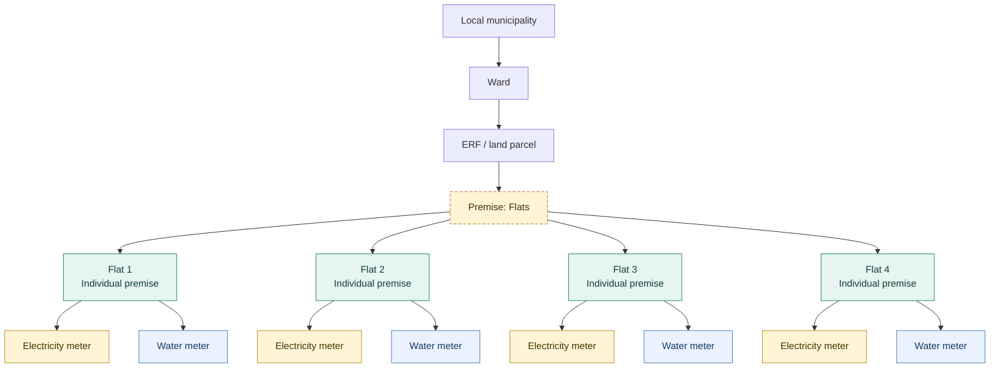
```mermaid
flowchart TD
    LM["Local municipality"] --> W["Ward"]
    W --> E["ERF / land parcel"]
    E --> G["Premise: Flats"]
    G --> P1["Flat 1<br/>Individual premise"]
    P1 --> EM1["Electricity meter"]
    P1 --> WM1["Water meter"]
    G --> P2["Flat 2<br/>Individual premise"]
    P2 --> EM2["Electricity meter"]
    P2 --> WM2["Water meter"]
    G --> P3["Flat 3<br/>Individual premise"]
    P3 --> EM3["Electricity meter"]
    P3 --> WM3["Water meter"]
    G --> P4["Flat 4<br/>Individual premise"]
    P4 --> EM4["Electricity meter"]
    P4 --> WM4["Water meter"]
    classDef grouping fill:#fff3d6,stroke:#ae7711,stroke-dasharray:5 3,color:#3d310e
    classDef premise fill:#e6f5f1,stroke:#218373,color:#123c36
    classDef electricity fill:#fff5d6,stroke:#bb8b26,color:#473300
    classDef water fill:#eaf2ff,stroke:#447fb7,color:#183a61
    class G grouping
    class P1 premise
    class EM1 electricity
    class WM1 water
    class P2 premise
    class EM2 electricity
    class WM2 water
    class P3 premise
    class EM3 electricity
    class WM3 water
    class P4 premise
    class EM4 electricity
    class WM4 water
```

Each flat is a distinct premise with its own Premise ID, shared Property Name and individual Unit Number. The Flats box groups the units for explanation; it is not an extra parent premise record.

### Townhouse Complex

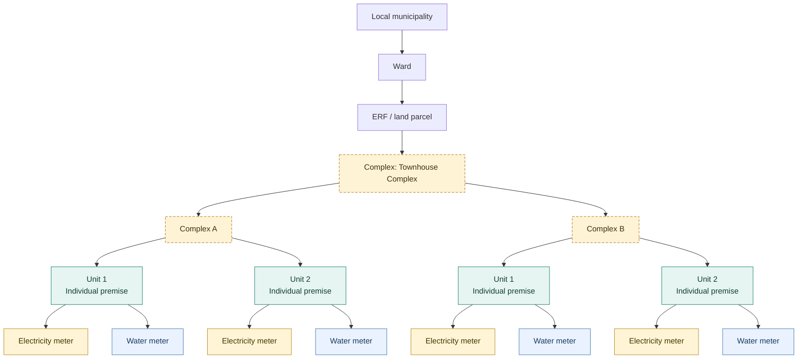
```mermaid
flowchart TD
    LM["Local municipality"] --> W["Ward"]
    W --> E["ERF / land parcel"]
    E --> G["Complex: Townhouse Complex"]
    G --> CA["Complex A"]
    G --> CB["Complex B"]
    CA --> P1["Unit 1<br/>Individual premise"]
    P1 --> EM1["Electricity meter"]
    P1 --> WM1["Water meter"]
    CA --> P2["Unit 2<br/>Individual premise"]
    P2 --> EM2["Electricity meter"]
    P2 --> WM2["Water meter"]
    CB --> P3["Unit 1<br/>Individual premise"]
    P3 --> EM3["Electricity meter"]
    P3 --> WM3["Water meter"]
    CB --> P4["Unit 2<br/>Individual premise"]
    P4 --> EM4["Electricity meter"]
    P4 --> WM4["Water meter"]
    classDef grouping fill:#fff3d6,stroke:#ae7711,stroke-dasharray:5 3,color:#3d310e
    classDef premise fill:#e6f5f1,stroke:#218373,color:#123c36
    classDef electricity fill:#fff5d6,stroke:#bb8b26,color:#473300
    classDef water fill:#eaf2ff,stroke:#447fb7,color:#183a61
    class G,CA,CB grouping
    class P1 premise
    class EM1 electricity
    class WM1 water
    class P2 premise
    class EM2 electricity
    class WM2 water
    class P3 premise
    class EM3 electricity
    class WM3 water
    class P4 premise
    class EM4 electricity
    class WM4 water
```

Complex A and Complex B illustrate different Property Names on one ERF. Each unit is a premise. A Property Name groups the units; it does not add a separate complex entity to the current record chain. Where the complexes occupy different ERFs, draw a separate ERF branch for each.

### Residential

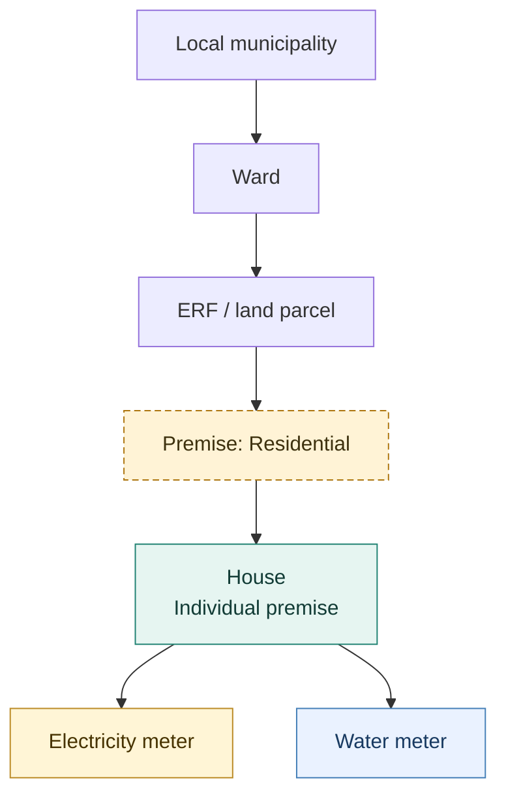
```mermaid
flowchart TD
    LM["Local municipality"] --> W["Ward"]
    W --> E["ERF / land parcel"]
    E --> G["Premise: Residential"]
    G --> P1["House<br/>Individual premise"]
    P1 --> EM1["Electricity meter"]
    P1 --> WM1["Water meter"]
    classDef grouping fill:#fff3d6,stroke:#ae7711,stroke-dasharray:5 3,color:#3d310e
    classDef premise fill:#e6f5f1,stroke:#218373,color:#123c36
    classDef electricity fill:#fff5d6,stroke:#bb8b26,color:#473300
    classDef water fill:#eaf2ff,stroke:#447fb7,color:#183a61
    class G grouping
    class P1 premise
    class EM1 electricity
    class WM1 water
```

The house is the service premise. Residential is currently a non-repeatable Property Type in Duplicate Premise. This form rule is not a claim that every real-world parcel contains only one dwelling; classify additional distinct premises using the correct supported type.

### Sectional Title

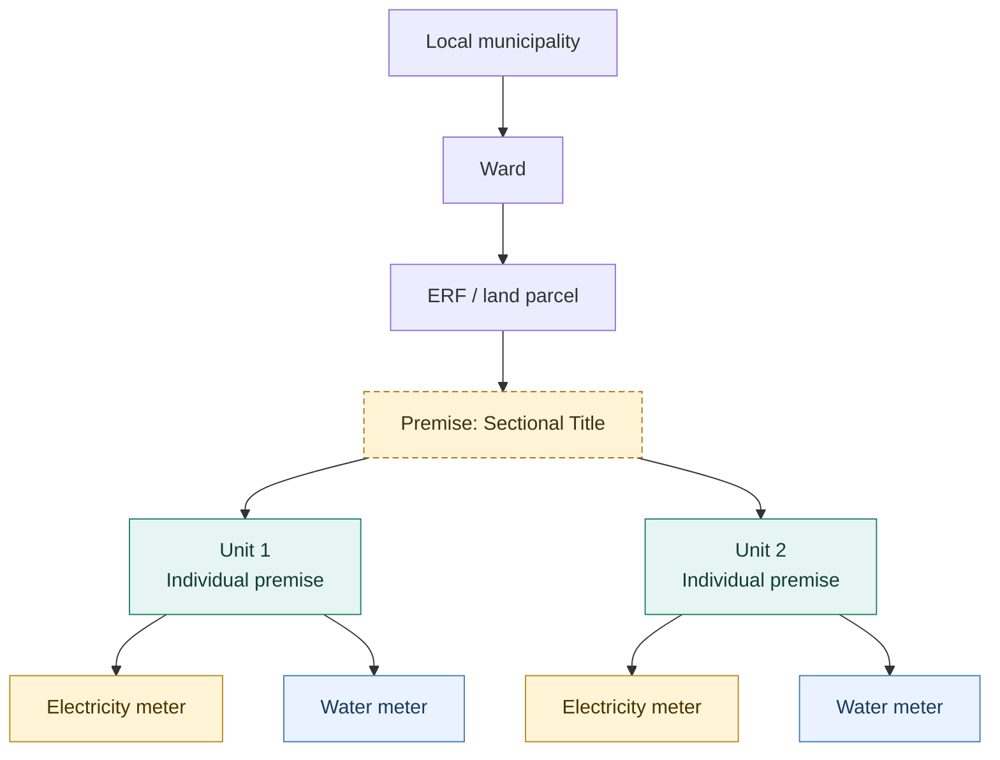
```mermaid
flowchart TD
    LM["Local municipality"] --> W["Ward"]
    W --> E["ERF / land parcel"]
    E --> G["Premise: Sectional Title"]
    G --> P1["Unit 1<br/>Individual premise"]
    P1 --> EM1["Electricity meter"]
    P1 --> WM1["Water meter"]
    G --> P2["Unit 2<br/>Individual premise"]
    P2 --> EM2["Electricity meter"]
    P2 --> WM2["Water meter"]
    classDef grouping fill:#fff3d6,stroke:#ae7711,stroke-dasharray:5 3,color:#3d310e
    classDef premise fill:#e6f5f1,stroke:#218373,color:#123c36
    classDef electricity fill:#fff5d6,stroke:#bb8b26,color:#473300
    classDef water fill:#eaf2ff,stroke:#447fb7,color:#183a61
    class G grouping
    class P1 premise
    class EM1 electricity
    class WM1 water
    class P2 premise
    class EM2 electricity
    class WM2 water
```

Separate units have separate Premise IDs. The diagram explains capture grouping, not legal ownership or sectional-title registration.

### Backroom

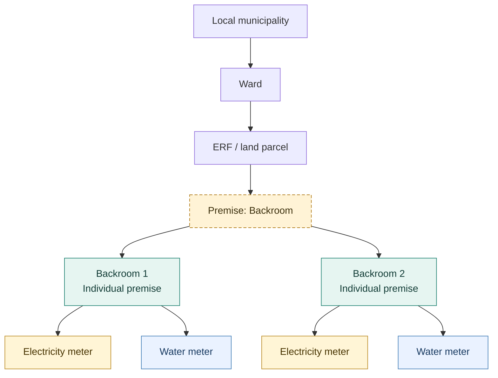
```mermaid
flowchart TD
    LM["Local municipality"] --> W["Ward"]
    W --> E["ERF / land parcel"]
    E --> G["Premise: Backroom"]
    G --> P1["Backroom 1<br/>Individual premise"]
    P1 --> EM1["Electricity meter"]
    P1 --> WM1["Water meter"]
    G --> P2["Backroom 2<br/>Individual premise"]
    P2 --> EM2["Electricity meter"]
    P2 --> WM2["Water meter"]
    classDef grouping fill:#fff3d6,stroke:#ae7711,stroke-dasharray:5 3,color:#3d310e
    classDef premise fill:#e6f5f1,stroke:#218373,color:#123c36
    classDef electricity fill:#fff5d6,stroke:#bb8b26,color:#473300
    classDef water fill:#eaf2ff,stroke:#447fb7,color:#183a61
    class G grouping
    class P1 premise
    class EM1 electricity
    class WM1 water
    class P2 premise
    class EM2 electricity
    class WM2 water
```

Each separately identified backroom is a premise. Capture only meters that actually serve the selected premise. Do not copy the main house meter onto every backroom.

### Commercial

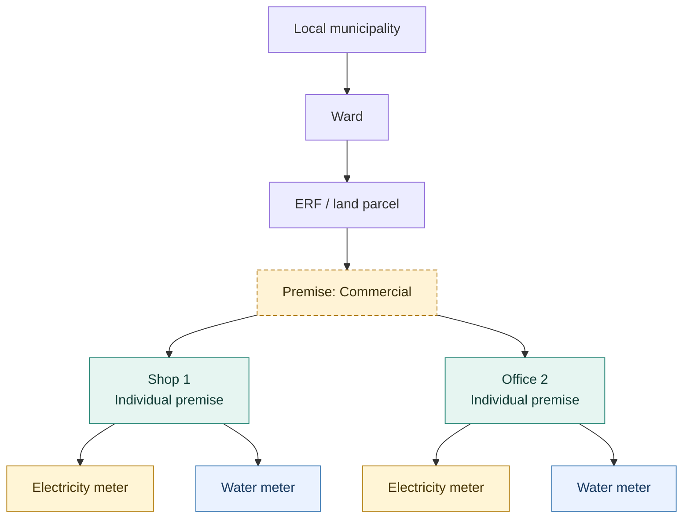
```mermaid
flowchart TD
    LM["Local municipality"] --> W["Ward"]
    W --> E["ERF / land parcel"]
    E --> G["Premise: Commercial"]
    G --> P1["Shop 1<br/>Individual premise"]
    P1 --> EM1["Electricity meter"]
    P1 --> WM1["Water meter"]
    G --> P2["Office 2<br/>Individual premise"]
    P2 --> EM2["Electricity meter"]
    P2 --> WM2["Water meter"]
    classDef grouping fill:#fff3d6,stroke:#ae7711,stroke-dasharray:5 3,color:#3d310e
    classDef premise fill:#e6f5f1,stroke:#218373,color:#123c36
    classDef electricity fill:#fff5d6,stroke:#bb8b26,color:#473300
    classDef water fill:#eaf2ff,stroke:#447fb7,color:#183a61
    class G grouping
    class P1 premise
    class EM1 electricity
    class WM1 water
    class P2 premise
    class EM2 electricity
    class WM2 water
```

A shop, office or other separately identified service location can be a premise. Unit Number is supported; these illustrative numbers do not make it compulsory for this type.

### Industrial

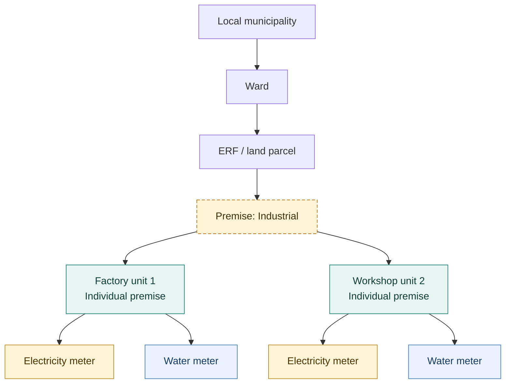
```mermaid
flowchart TD
    LM["Local municipality"] --> W["Ward"]
    W --> E["ERF / land parcel"]
    E --> G["Premise: Industrial"]
    G --> P1["Factory unit 1<br/>Individual premise"]
    P1 --> EM1["Electricity meter"]
    P1 --> WM1["Water meter"]
    G --> P2["Workshop unit 2<br/>Individual premise"]
    P2 --> EM2["Electricity meter"]
    P2 --> WM2["Water meter"]
    classDef grouping fill:#fff3d6,stroke:#ae7711,stroke-dasharray:5 3,color:#3d310e
    classDef premise fill:#e6f5f1,stroke:#218373,color:#123c36
    classDef electricity fill:#fff5d6,stroke:#bb8b26,color:#473300
    classDef water fill:#eaf2ff,stroke:#447fb7,color:#183a61
    class G grouping
    class P1 premise
    class EM1 electricity
    class WM1 water
    class P2 premise
    class EM2 electricity
    class WM2 water
```

Separate industrial service locations may have different premises and metering arrangements. These examples are not a design for bulk, check or process metering.

### Estate

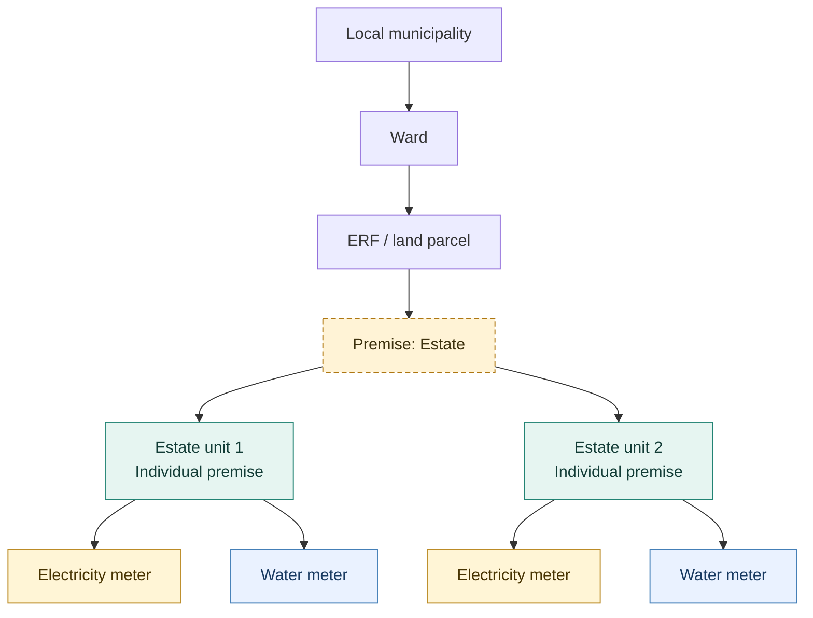
```mermaid
flowchart TD
    LM["Local municipality"] --> W["Ward"]
    W --> E["ERF / land parcel"]
    E --> G["Premise: Estate"]
    G --> P1["Estate unit 1<br/>Individual premise"]
    P1 --> EM1["Electricity meter"]
    P1 --> WM1["Water meter"]
    G --> P2["Estate unit 2<br/>Individual premise"]
    P2 --> EM2["Electricity meter"]
    P2 --> WM2["Water meter"]
    classDef grouping fill:#fff3d6,stroke:#ae7711,stroke-dasharray:5 3,color:#3d310e
    classDef premise fill:#e6f5f1,stroke:#218373,color:#123c36
    classDef electricity fill:#fff5d6,stroke:#bb8b26,color:#473300
    classDef water fill:#eaf2ff,stroke:#447fb7,color:#183a61
    class G grouping
    class P1 premise
    class EM1 electricity
    class WM1 water
    class P2 premise
    class EM2 electricity
    class WM2 water
```

The units shown share the example ERF. If units occupy separate land parcels, place them under their actual ERFs instead of forcing the estate onto one parcel.

### Church

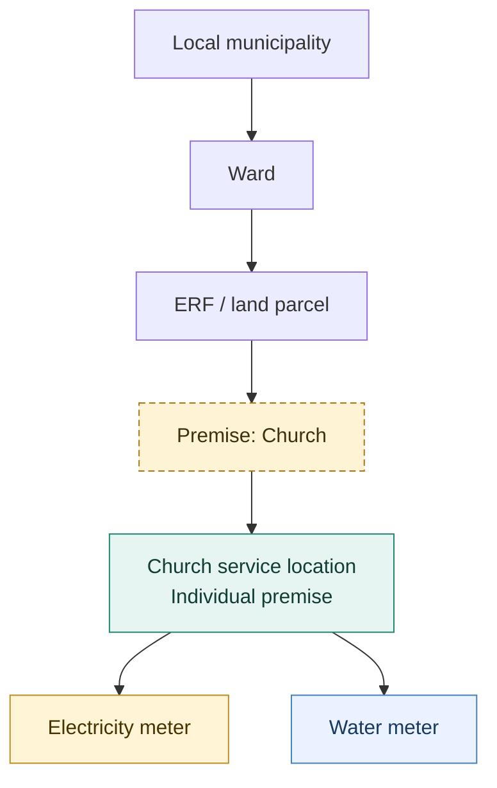
```mermaid
flowchart TD
    LM["Local municipality"] --> W["Ward"]
    W --> E["ERF / land parcel"]
    E --> G["Premise: Church"]
    G --> P1["Church service location<br/>Individual premise"]
    P1 --> EM1["Electricity meter"]
    P1 --> WM1["Water meter"]
    classDef grouping fill:#fff3d6,stroke:#ae7711,stroke-dasharray:5 3,color:#3d310e
    classDef premise fill:#e6f5f1,stroke:#218373,color:#123c36
    classDef electricity fill:#fff5d6,stroke:#bb8b26,color:#473300
    classDef water fill:#eaf2ff,stroke:#447fb7,color:#183a61
    class G grouping
    class P1 premise
    class EM1 electricity
    class WM1 water
```

Use the church Property Name. The example has one premise; separate buildings do not automatically mean separately metered premises.

### School

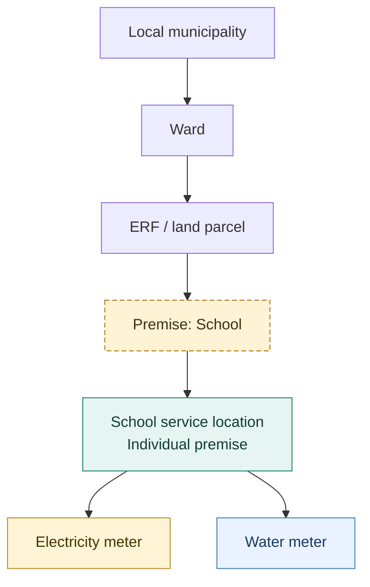
```mermaid
flowchart TD
    LM["Local municipality"] --> W["Ward"]
    W --> E["ERF / land parcel"]
    E --> G["Premise: School"]
    G --> P1["School service location<br/>Individual premise"]
    P1 --> EM1["Electricity meter"]
    P1 --> WM1["Water meter"]
    classDef grouping fill:#fff3d6,stroke:#ae7711,stroke-dasharray:5 3,color:#3d310e
    classDef premise fill:#e6f5f1,stroke:#218373,color:#123c36
    classDef electricity fill:#fff5d6,stroke:#bb8b26,color:#473300
    classDef water fill:#eaf2ff,stroke:#447fb7,color:#183a61
    class G grouping
    class P1 premise
    class EM1 electricity
    class WM1 water
```

Use the school Property Name. A classroom is not automatically a separate premise or separately metered unit.

### Government

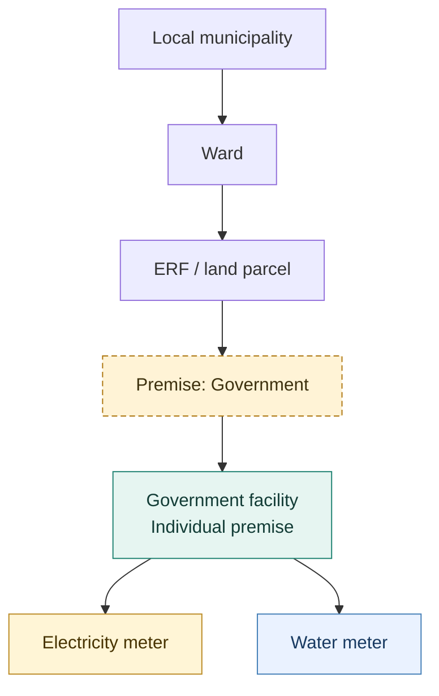
```mermaid
flowchart TD
    LM["Local municipality"] --> W["Ward"]
    W --> E["ERF / land parcel"]
    E --> G["Premise: Government"]
    G --> P1["Government facility<br/>Individual premise"]
    P1 --> EM1["Electricity meter"]
    P1 --> WM1["Water meter"]
    classDef grouping fill:#fff3d6,stroke:#ae7711,stroke-dasharray:5 3,color:#3d310e
    classDef premise fill:#e6f5f1,stroke:#218373,color:#123c36
    classDef electricity fill:#fff5d6,stroke:#bb8b26,color:#473300
    classDef water fill:#eaf2ff,stroke:#447fb7,color:#183a61
    class G grouping
    class P1 premise
    class EM1 electricity
    class WM1 water
```

Use the facility Property Name. Do not assume every office or department has separate meters.

### Vacant Land

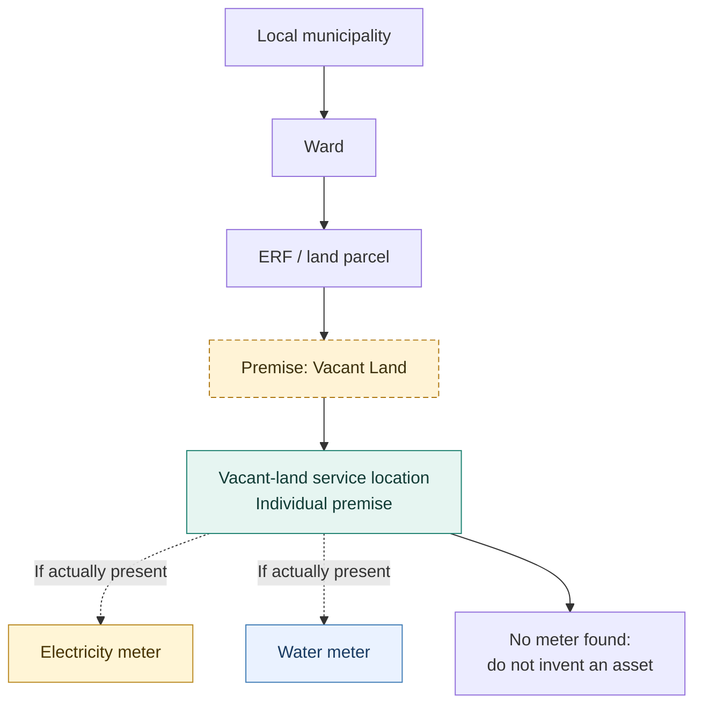
```mermaid
flowchart TD
    LM["Local municipality"] --> W["Ward"]
    W --> E["ERF / land parcel"]
    E --> G["Premise: Vacant Land"]
    G --> P1["Vacant-land service location<br/>Individual premise"]
    P1 -. "If actually present" .-> EM1["Electricity meter"]
    P1 -. "If actually present" .-> WM1["Water meter"]
    P1 --> NONE["No meter found:<br/>do not invent an asset"]
    classDef grouping fill:#fff3d6,stroke:#ae7711,stroke-dasharray:5 3,color:#3d310e
    classDef premise fill:#e6f5f1,stroke:#218373,color:#123c36
    classDef electricity fill:#fff5d6,stroke:#bb8b26,color:#473300
    classDef water fill:#eaf2ff,stroke:#447fb7,color:#183a61
    class G grouping
    class P1 premise
    class EM1 electricity
    class WM1 water
```

Vacant land can have no meter, or an existing service meter. Capture only equipment actually found and correctly associated; do not invent a meter to complete the diagram.

### Mixed property types and shared meters

One ERF may contain a Residential house plus Backroom premises, or Commercial premises plus Flats. Use the same structure for each applicable type under that ERF. The examples do not create a rule that every ERF has only one Property Type.

If a site has one bulk meter supplying several units, do not repeat its serial number as if each unit has its own meter. Verify the actual service association and obtain guidance for a shared-service case that the current model cannot represent clearly. Meter identity, unit association and physical position are separate facts.

The relationship is an **administrative/service association**, not a statement of legal ownership of the meter or land. Utility asset ownership, customer account, service point, parcel and mounting position are different concepts. This draft does not invent an asset-owner field where the inspected form has none.

The current submission requires a saved parent premise. If it exists only as a local unsent draft, meter submission must wait for the premise to be saved. Choosing the wrong premise is not repaired by placing a correct GPS pin: the association and position must each be right.

### A meter can be outside the ERF it serves

**The meter's position answers “where is it?” Its premise association answers “which property does it serve?” Those answers can point to different places.**

In this example, House A is inside ERF A and House B is inside ERF B. A single kiosk stands on the roadside verge, outside the front boundary of both ERFs. It contains two separate meters: Meter A serves House A; Meter B serves House B.

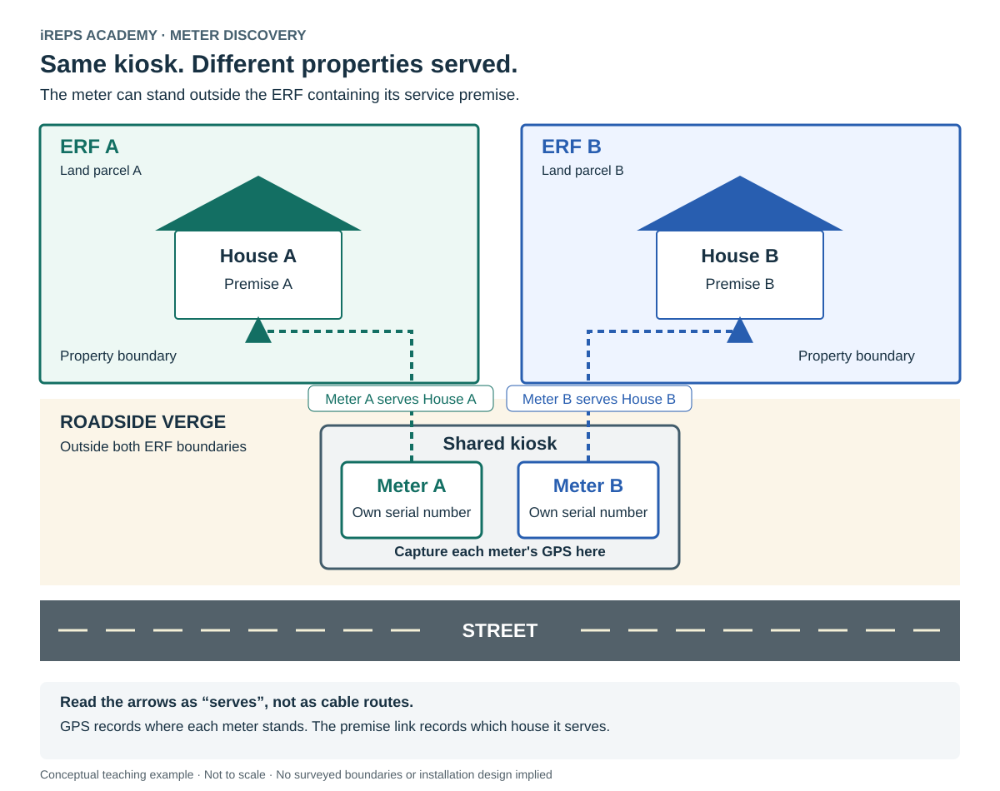

| Capture question | Meter A | Meter B |
| --- | --- | --- |
| Which premise is served? | House A | House B |
| Which ERF contains that premise? | ERF A | ERF B |
| Where is the meter physically mounted? | Shared roadside kiosk | Same roadside kiosk |
| Where should its meter GPS pin be? | At Meter A's actual position in the kiosk | At Meter B's actual position in the kiosk |
| Electricity placement | Kiosk | Kiosk |

The coloured dotted arrows mean **serves**; they do not depict actual cables, ownership or surveyed service routes. Each meter keeps its own serial number and premise association even when their GPS coordinates are very close. A kiosk label alone is not proof of which house each meter serves. Verify the association from the available authorised evidence; do not guess from proximity.

Do not move either meter pin into the house to make it appear inside the parcel. The reviewed GPS validator checks coordinates; it does not require an accessed meter pin to lie inside its associated ERF. This is a conceptual site plan, not a surveyed boundary or electrical installation drawing.

## 4. Understanding the physical environment

The electricity form offers the following placement choices. They describe where equipment is located; they do not grant access or authority to work on it.

| Placement | Interpretation for capture | Distinction to preserve |
| --- | --- | --- |
| Kiosk | Meter housed in a kiosk/enclosure, potentially shared | Identify the individual meter and served premise; the enclosure is not the meter identity |
| Pole Top | Equipment mounted high on a pole | Record the mounting context; discovery is not a climbing procedure |
| Pole Bottom | Equipment at the lower part/base area of a pole | Distinguish from nearby cabinets and other service meters |
| Boundary Wall | Mounted on or within a boundary wall | The side of the wall and served premise may need explanation |
| Meter Room | Dedicated room with one or several meters | Room location and the unit served are different facts |
| Wall Indoors | Mounted on an internal wall | Indoor position does not alone identify the correct unit or account |
| Inside Property | Located within the property where a more specific option does not describe it | Use field comments to remove ambiguity |
| Other | None of the listed choices is suitable | The inspected placement control has no separate required Other-description field; explain in Field Comment |

### Placement examples: context and closer views

The eight plates below provide **16 realistic teaching views**. Each plate is **AI-generated**, as marked on the image. They are not photographs from a real iREPS inspection, evidence of an installed compliant system, or proof of a meter-to-premise association. Use them to recognise placement and plan useful field photographs. Actual field photographs will be added as a separately identified media class with source and usage information.

For each placement, collect enough context to explain **where the meter is**, plus the required evidence that identifies **which meter it is**. The examples below are teaching captions and sample comments, not additional mandatory form fields. [Media provenance and generation prompts](../07-media-and-evidence/meter-discover-media-register.md) are retained by Academy.

#### Kiosk

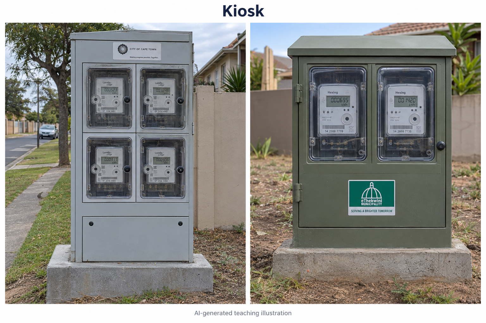

**What the two views show:** A freestanding roadside multi-meter kiosk and a smaller outdoor cabinet.

**Recognition cues:** Look for an enclosure standing independently on its own plinth or support, with one or more meters inside. The wider view shows where the kiosk stands; the closer view identifies the individual metering positions.

**Avoid confusion:** A kiosk can contain several meters serving different premises. The kiosk identity is not the meter serial number. Do not assume every electrical cabinet contains revenue meters.

**Example Field Comment:** “The roadside kiosk outside the front boundary contains four meters; the meter for Flat 1 is in the upper-left position.”

#### Pole Top

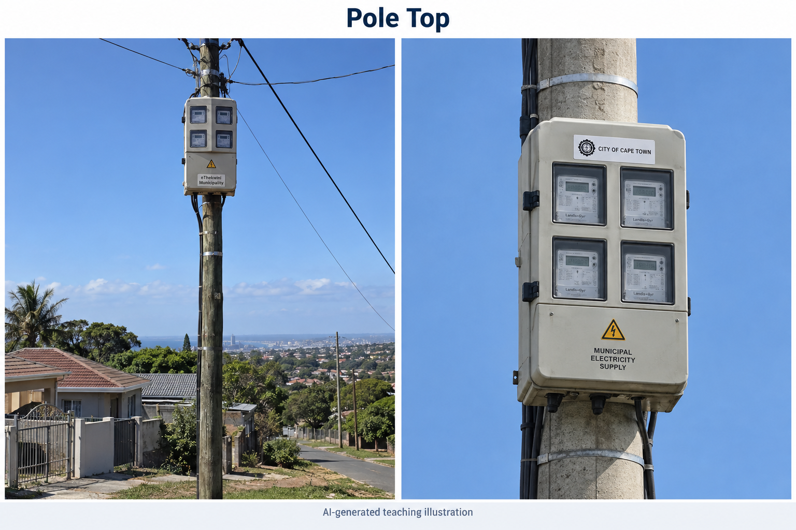

**What the two views show:** Meter enclosures mounted high above ground on utility poles.

**Recognition cues:** The pole continues well below the meter box. The box sits overhead rather than near the base. Meter windows distinguish the illustrated metering box from other pole equipment.

**Avoid confusion:** A transformer, distribution box or streetlight is not automatically a meter. This is a recognition example, not a climbing or access procedure.

**Example Field Comment:** “Meter enclosure mounted high on the roadside pole opposite the entrance; meter identity needs authorised verification.”

#### Pole Bottom

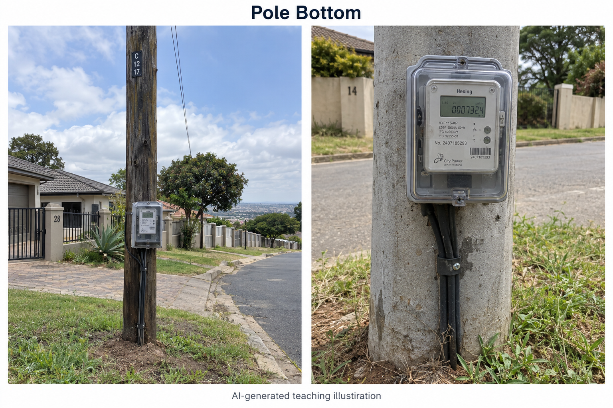

**What the two views show:** Meter boxes fixed directly to the lower section of poles, with the ground visible.

**Recognition cues:** Look at both the attachment and the height. The enclosure is fixed to the pole itself at its lower section; the context view includes the base so the position is clear.

**Avoid confusion:** A cabinet standing beside a pole is not pole-mounted merely because the pole is close. This placement label does not establish an exact permitted mounting height.

**Example Field Comment:** “Meter box fixed to the lower section of the concrete pole beside the gate.”

#### Boundary Wall

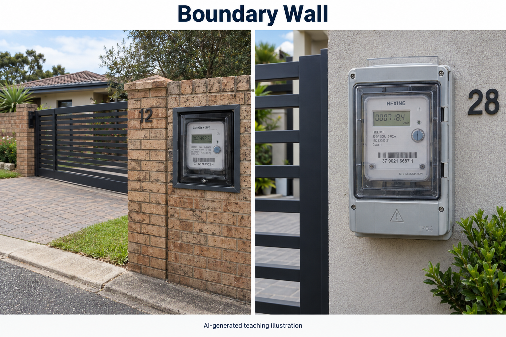

**What the two views show:** Recessed and surface-mounted meter enclosures on property boundary walls.

**Recognition cues:** The gate, pavement and wall identify the property boundary. The meter can face the road or the property; describe the side where it is accessed.

**Avoid confusion:** Distinguish the boundary wall from an internal room wall and from an external wall of the house. Proximity to a gate alone is not proof that the wall is the parcel boundary.

**Example Field Comment:** “Meter enclosure recessed into the street-facing boundary wall, immediately left of the vehicle gate.”

#### Meter Room

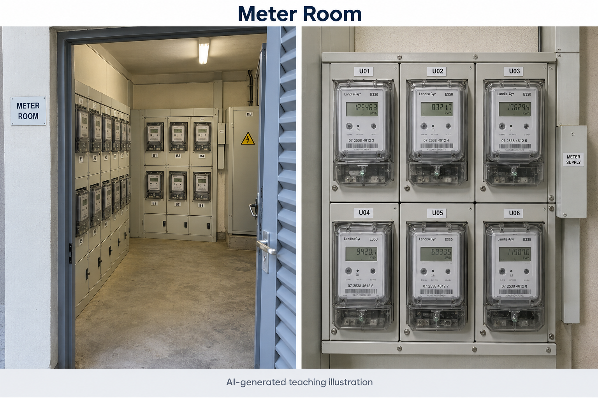

**What the two views show:** A dedicated communal meter room and a closer bank of individual meters.

**Recognition cues:** The wider view establishes that this is a room used for metering. The closer view shows that several meters can occupy the same room while serving different units.

**Avoid confusion:** Being in one room does not make all meters belong to one premise. Verify each serial and unit association rather than relying on the room number or an unverified label.

**Example Field Comment:** “Shared meter room on the ground floor; meter for Flat 2 is in the second position on the left-hand bank.”

#### Wall Indoors

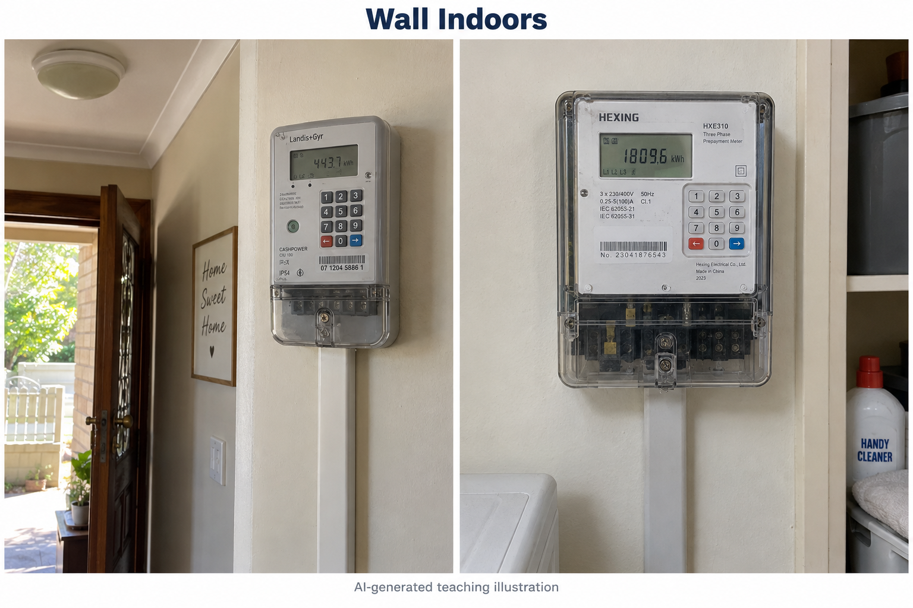

**What the two views show:** Meters mounted on internal walls in a home entrance area and a household utility area.

**Recognition cues:** Doorways, ceiling and domestic surroundings establish that the meter is indoors. Identify the actual meter body and register, not just a remote prepaid keypad.

**Avoid confusion:** A meter bank in a dedicated meter room is more specifically described by Meter Room. “Indoors” does not itself identify which unit the meter serves.

**Example Field Comment:** “Meter mounted on the interior entrance-hall wall of Flat 1, above the enclosed cable conduit.”

#### Inside Property

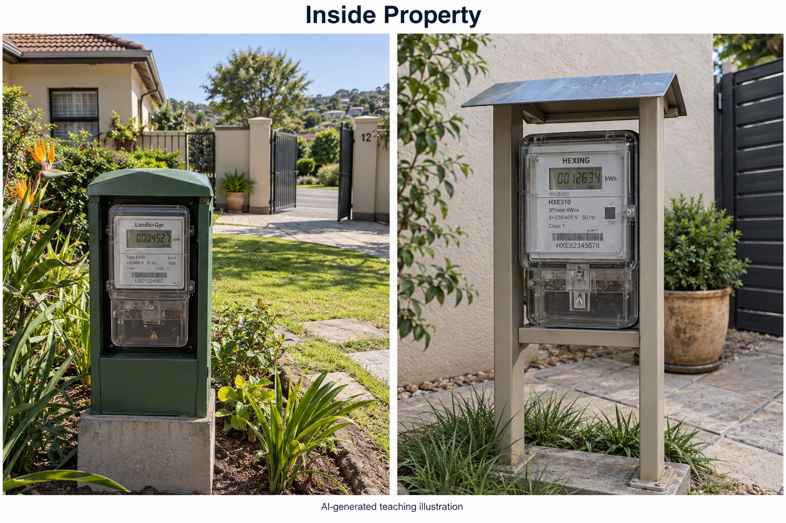

**What the two views show:** Meter equipment within a private garden and an enclosed courtyard.

**Recognition cues:** The important context is that the equipment is inside the property. Include the entrance, fence or surrounding buildings in the context photograph so the description is understandable.

**Avoid confusion:** This is a broad location description and can overlap a more specific mounting description. If the equipment is clearly a Kiosk, on a Boundary Wall or on a Pole, that more specific label explains the mounting better. These images illustrate inside-boundary context; they do not prove that Inside Property is the correct selection for every such assembly. Product rules for overlapping choices still need confirmation.

**Example Field Comment:** “Meter at a small service pedestal in the enclosed rear courtyard, approximately five metres inside the entrance; see context photo.”

#### Other

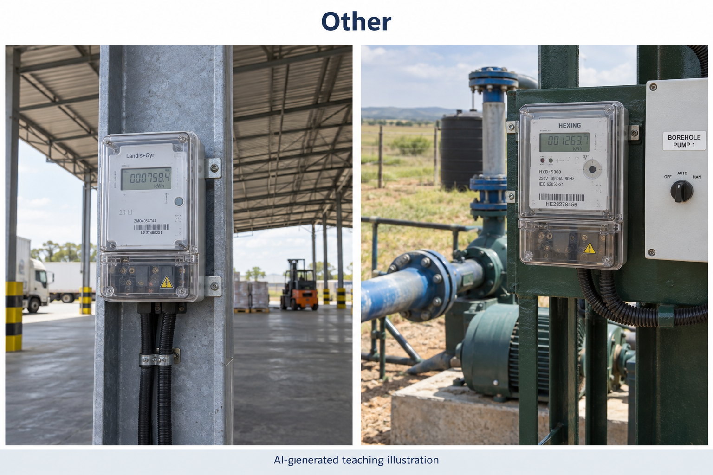

**What the two views show:** Illustrative unusual mounting arrangements on a structural frame and a pump equipment skid.

**Recognition cues:** Use Other only when the listed choices do not adequately describe the observed position. Explain the actual support, location, access direction and nearby landmarks in Field Comment.

**Avoid confusion:** These are examples to discuss, not newly approved placement categories. Apply a more specific listed choice where it fits. The inspected form does not enforce a separate Other-description input.

**Example Field Comment:** “Meter enclosure attached to the steel support of the pump equipment frame beneath the open canopy; not wall- or pole-mounted.”

Water meters may be encountered in boxes, chambers or other arrangements. The inspected water discovery form captures GPS but **does not expose the electricity placement selector**. A water-specific placement/enclosure taxonomy remains a product-content gap. Do not teach an electricity-only field as though it appears on water.

A complete site explanation can distinguish the parcel, service address/unit, enclosure, mounting position, accessibility, neighbouring meters, serial-number visibility and the evidence used to associate the equipment with the premise. Some of these are structured inputs; others currently belong in an optional field comment. Record uncertainty rather than guessing an association or a serial number.

## 5. How a worker reaches a discovery

The two named entry paths are **Normal Path** and **Sales Path**. Use these names consistently in diagrams, lessons, manuals and assessments. Both lead to meter capture on the correct premise. Reopening a local draft is a recovery action within its original path, not a third named entry path.

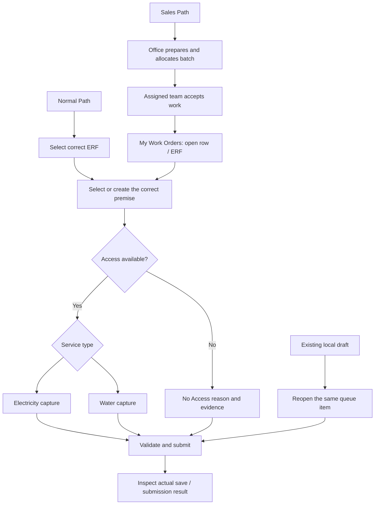
```mermaid
flowchart TD
    N[Normal Path] --> E[Select correct ERF]
    S[Sales Path] --> B[Office prepares and allocates batch]
    B --> A[Assigned team accepts work]
    A --> W[My Work Orders: open row / ERF]
    E --> P[Select or create the correct premise]
    W --> P
    P --> Q{Access available?}
    Q -->|No| NA[No Access reason and evidence]
    Q -->|Yes| T{Service type}
    T --> EL[Electricity capture]
    T --> WA[Water capture]
    EL --> V[Validate and submit]
    WA --> V
    NA --> V
    V --> R[Inspect actual save / submission result]
    D[Existing local draft] --> O[Reopen the same queue item]
    O --> V
```

### Normal Path

A worker identifies the correct ERF, selects or creates its premise, then records electricity, water or No Access through the discovery action. The Normal Path can encounter a meter with or without a Sales record. It is not automatically free of batch restrictions: the backend can check the meter and ERF even when the worker did not enter through My Work Orders.

### Sales Path

The office uses Sales information and location work to plan a batch; the assigned team accepts it. The worker follows a row to its ERF/premise. The carried context identifies the batch, row, Sales record and expected meter. The current planning rule uses batches of at most 30 meters; this is context for the Sales Path, not a limit on how many meters can physically exist on an ERF.

The expected Sales number is a lead. The worker must verify the actual number in the field. Recording the number that was expected when another meter is actually present would destroy the point of discovery. The expected and discovered identifiers must remain distinguishable.

| Situation | Capture and reconciliation meaning |
| --- | --- |
| Expected Sales meter is found | Record its actual identity; matching field/Sales links can make it VISIBLE and complete the applicable work |
| Different meter is found at the expected ERF | Record the meter actually found. The newer batch rules include a specific different-meter outcome; they must not falsely claim the expected serial was physically found |
| Meter is found outside a batch and has a Sales match | Field capture can establish the missing field link; any batch effects remain subject to ownership and correlation checks |
| Meter has no Sales match | It can be a valid field asset with no Sales link; INVISIBLE does not mean nonexistent |
| No Access | Record the attempted visit and its evidence; do not invent an asset identity or count the meter as physically discovered |

The source baseline records differences between application branches. Batch closure, different-meter attribution and replacement handoff must be verified together before the Sales Path is taught as an accepted release. The backend's batch-context validator directs a No Access visit to the dedicated Targeted Batch No Access action; the diagram shows the business outcome, not a claim that both paths share one submission endpoint.

## 6. What is observed and captured

The [field catalogue](meter-discover-field-catalogue.md) is the detailed reference. The form combines these families:

1. **Visit and parent context:** access outcome, reason where access failed, ERF, premise, address, geography and provider context.
2. **Identity and description:** meter number, manufacturer, model, service, subtype, category and electricity phase.
3. **Location:** the actual GPS position and, for electricity, placement.
4. **Associated equipment:** electricity seal, prepaid keypad and circuit breaker, with reasons/evidence where applicable.
5. **State and readings:** connected/disconnected state, water creation reading or token reading, and prepaid remaining credit.
6. **Findings and response:** anomaly, detail, additional anomalies, electricity normalisation actions and reasons when expected work is not undertaken.
7. **Evidence and commentary:** tagged photographs plus optional text, photo, voice and video comments.
8. **System record:** transaction identity, authenticated actor/time, route correlation, queue state and server-derived references.

Some controls contain numeric-looking strings. Meter numbers must preserve leading zeros. Remaining credit is stored as a signed decimal string; a zero value is different from a missing value. The form does not establish a universal credit unit, so the lesson must not silently describe every value as rand or kWh. Water token reading and remaining credit are separate inspected inputs whose business distinction needs confirmation.

## 7. Connection state, finding, response and visibility

These are independent dimensions. **Connected/Disconnected** records the observed connection state. **Meter Ok/Faulty/Damaged/Illegally Connected** records the finding. **Normalisation** records on-site actions or the follow-on work requested. **VISIBLE/INVISIBLE** reflects the field/Sales linkage. A connected meter can be faulty; a meter described as Meter Ok can still carry a bridge or bypass suspicion; a VISIBLE meter can still need work.

### Findings

| Finding | Details offered in the inspected list |
| --- | --- |
| Meter Ok | Operationally Ok; Bridge Suspicion; Bypass Suspicion |
| Meter Faulty | Not Accepting Sgc Tokens; Meter Display Blank; Negative Credit Units; Zero Reading - Conventional Meter; Meter Wheel Not Moving; Meter Wheel Running In Reverse |
| Meter Damaged | Meter Number Not Clearly Visible; Meter Burnt; Meter Button(s) Not Working; Meter Broken |
| Illegally Connected | Straight Connection (Meter Bypassed); Bridge Wire On The Meter |

These labels are reproduced as application vocabulary, including spelling. A suspicion remains a suspicion. The common list includes electricity-oriented details in a shared component; water applicability needs review rather than assuming every listed detail makes physical sense for every water meter.

Additional anomalies are independent selections: Meter Blocked (By Munic), Meter Bridged (By Munic), Incomplete Service Points, Meter Not Registered and Keypad Faulty. Their presence does not replace the primary finding/detail.

### Electricity normalisation and follow-on work

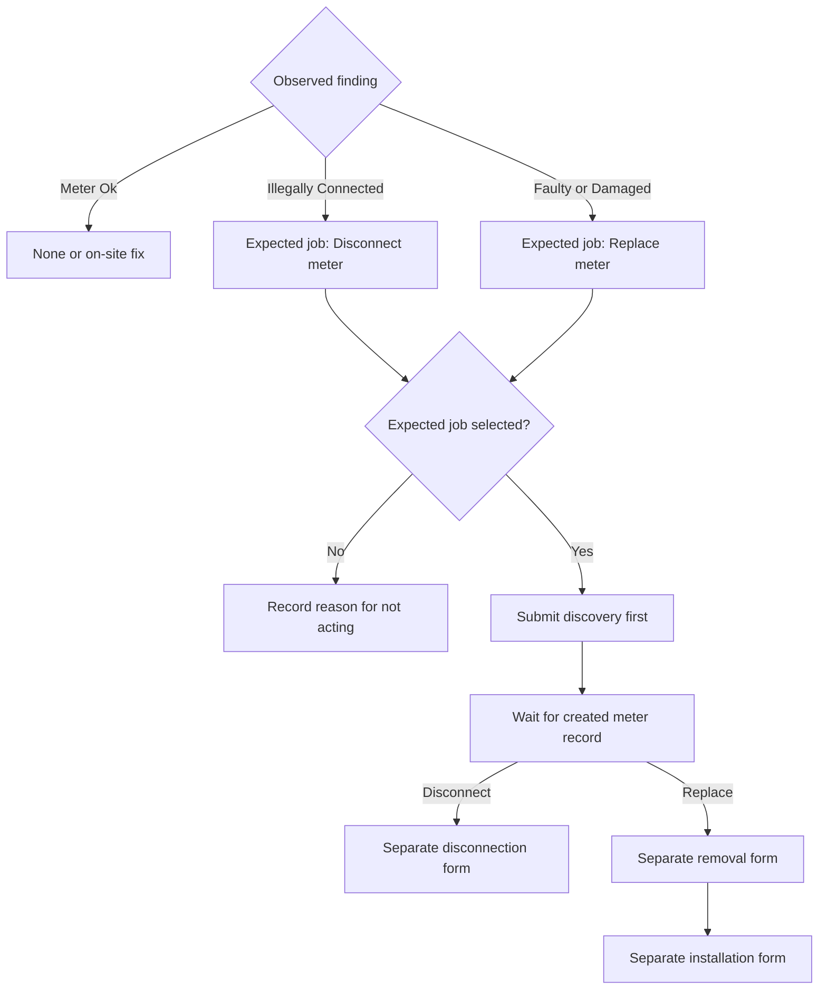
```mermaid
flowchart TD
    F{Observed finding} -->|Meter Ok| O[None or on-site fix]
    F -->|Illegally Connected| D[Expected job: Disconnect meter]
    F -->|Faulty or Damaged| X[Expected job: Replace meter]
    D --> Q{Expected job selected?}
    X --> Q
    Q -->|No| R[Record reason for not acting]
    Q -->|Yes| S[Submit discovery first]
    S --> M[Wait for created meter record]
    M -->|Disconnect| DC[Separate disconnection form]
    M -->|Replace| RM[Separate removal form]
    RM --> IN[Separate installation form]
```

In the examined mobile feature, selecting a finding preselects its expected action. A worker must still confirm what will actually be done. None is offered only for Meter Ok. When every action is unticked on another finding, the form can still encode `none` internally together with the required reason; the hidden menu choice and the stored no-action representation are different. On-site fixes are Tamper removed, Keypad normalised, Service point completed and Meter registered. A finding cannot request both Disconnect meter and Replace meter in the same action list.

If the expected job is not selected, a reason is required even when a different action or an on-site fix is selected. Current reasons include threat, refusal, unsafe conditions, inability to reach the meter, lack of a replacement, office instruction and Other with an explanation. These choices document the situation; they do not authorise a physical intervention.

The original finding and the meter's later operational condition can differ. The newer normalisation rules describe a projection reflecting what was left after a fix, while the transaction retains what was found. Discovery, removal, installation and disconnection need linked records so a report can distinguish intention from completed work. QA/correction policy is still open and must not be inferred from these links.

The water form does not offer this electricity normalisation workflow. Do not promise an automatic water replacement chain from this screen.

## 8. Evidence and quality

A photograph must support a specific statement. The serial photograph identifies the meter; an anomaly photograph supports the finding; a seal/keypad/circuit-breaker photograph supports the corresponding captured value or evidence-requiring reason. A general scene photograph cannot automatically substitute for a required tagged photograph.

All anomaly details except Operationally Ok require an anomaly photo in the inspected contract, including Bridge Suspicion and Bypass Suspicion. Selecting only a disconnection or replacement job does not require a normalisation photo in the newer feature: the separate job forms provide their own evidence. An on-site fix does require proof. See the catalogue for the complete evidence matrix and branch compatibility warning.

Evidence presence is not evidence quality. A tagged image can pass a technical presence check while being blurred or showing the wrong meter. The proposed review standard is to check legibility, relevance, consistent identity, location context and the relationship between the finding and its proof. This is a content quality recommendation, not a claim that an automated QA module currently performs these checks.

The actual meter position and a photograph's capture/fallback position need not be the same. A manually confirmed map pin is not proof that the device physically stood there. No GPS accuracy threshold or parcel-containment guarantee was found in the discovery validator.

## 9. What completion means

Use three checkpoints:

| Checkpoint | Meaning |
| --- | --- |
| Saved locally | A device queue record exists; server acceptance is not established |
| Server accepted | The discovery transaction was accepted or the same transaction was already present |
| Derived work available | The asset/master/registry and relevant Sales or batch effects are visible, and any follow-on work can be opened or checked |

The backend uses asynchronous processing after transaction creation. A success response does not guarantee that every derived view has already updated. The phone may wait up to 20 seconds for the meter before opening follow-on work; if the record is not ready it directs the worker to the meter card. A missing derived record should be investigated with the transaction ID rather than creating a second discovery.

The inspected form also reuses a generic success display after some local-save outcomes. Read the specific result message and queue/server state; a green icon alone does not establish server submission. The [rules and data lifecycle](meter-discover-rules-and-data.md) explains the different offline branches and why a timeout does not cancel a request already in flight.

## 10. Examples and boundaries

**Shared roadside kiosk.** Record the serial found, associate it with the correct house/unit, place the pin at the kiosk, choose Kiosk and explain any ambiguity. Nearby ERF geometry is orientation, not proof of the service association.

**A damaged meter with an unreadable number.** The anomaly list allows that finding, but an accessed discovery still requires a valid identifier. Do not manufacture one or type NAv to force the form through. Escalate the identification case; the supported unidentified-meter workflow needs a product decision.

**A different meter at a Sales address.** Keep the expected Sales number in the route context and capture the actual physical number. The different-meter outcome can explain why an expected Sales visit is closed without claiming the expected meter was found. Multi-premise/shared-enclosure cases need careful correlation review.

**Access refused.** Capture No Access, an appropriate reason and required evidence. This is a visit transaction, not an asset discovery or proof of a meter condition that could not be observed.

**Submission takes too long.** Retain the existing queued transaction and check its outcome. The server may have accepted it after the phone stopped waiting. Retrying the same transaction and creating a new transaction are different operations.

## 11. Boundaries and open decisions

The owner's unresolved permissions, common offline model, acknowledgement/local deletion and QA questions remain in the [decision register](../00-academy-governance/OWNER_DECISIONS.md). This module adds concrete cases: unreadable identifiers, water placement, water manufacturer Other, reading/credit units, mixed electricity/water anomaly choices, branch compatibility, ambiguous success messages and resuming follow-on work after background sync.

The first package supplies substantive reference content and tasks. Screen captures, role-by-role walkthroughs, verified device outcomes, recorded demonstrations and completed assessments remain publication work. It is comprehensive in its defined structure; it does not claim that unresolved behaviour or uninspected infrastructure errors have already been settled.

Use the [master dictionary](../15-dictionary/iREPS_Master_Dictionary.md) for shared terminology. Proposed module-specific term changes must go through Academy rather than create a competing glossary.
