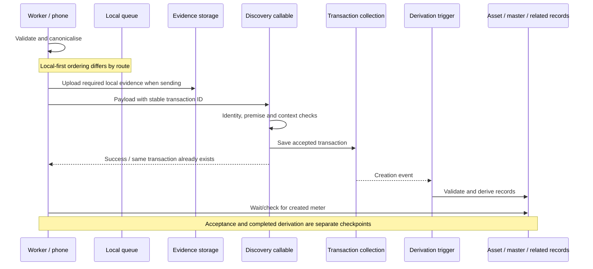
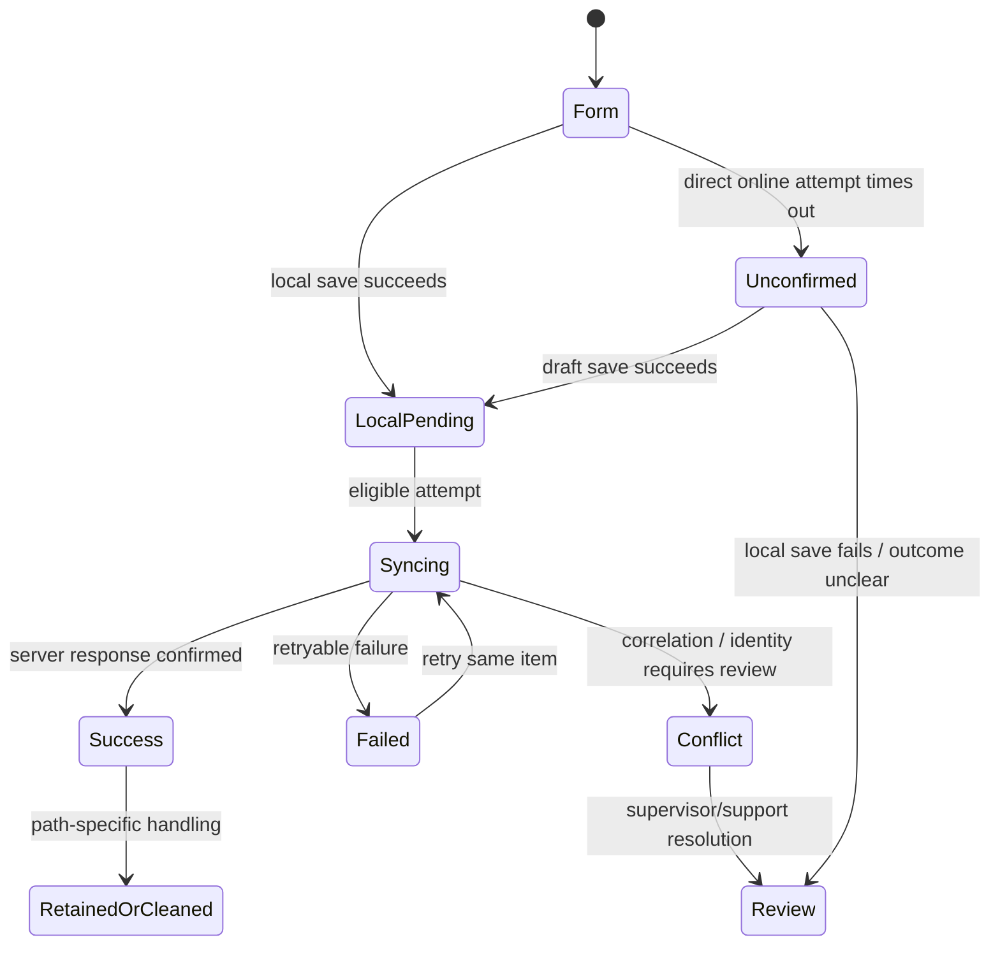

# Meter Discover — rules and data lifecycle

**MDIS · version 0.1 · source-based draft.** Read alongside the [Body of Knowledge](meter-discover-body-of-knowledge.md), [field catalogue](meter-discover-field-catalogue.md) and [source baseline](../00-academy-governance/source-assessments/meter-discover-source-baseline-2026-09-23.md). Observed implementation is not proof of a deployed release, nor a new decision on the owner's open permissions/offline/QA questions.

## 1. Identities that must not be confused

| Identity | Purpose | Observed relationship |
| --- | --- | --- |
| ERF ID / number | Parcel association | Inherited from parent premise, together with geographical parents |
| Premise ID | The service location holding the meter | A real saved premise must exist before server acceptance |
| Meter number | Physical identifier / master correlation | Cleaned identifier; leading zeros preserved; master keyed by normalised number |
| Transaction ID | One submitted discovery event | Client generates `TRN_MDIS_<time>_<service>_<ward>_<erf>`; reused when reopening/retrying its queued record |
| Asset ID | Field asset created by discovery | Inspected trigger uses discovery transaction ID as new asset ID |
| Sales document ID | Commercial/Sales identity | May already exist before the field asset; absent Sales link is possible |
| Batch and row IDs | Assigned work and its expected meter | Carried separately from the actual meter number typed in the form |
| Local queue item ID | Device retention/retry wrapper | Contains payload transaction ID; queue ID is not itself the meter number |

The input component removes whitespace and uppercases ASCII lowercase letters. A local duplicate warning searches the device's loaded warehouse data after more than three characters; that condition is not a rule that a meter number must be longer than three characters. Server/master checks can detect conflicts missed by the local data.

## 2. Responsibilities and observed permission checks

| Actor / layer | Responsibility in the module | Evidence and limit |
| --- | --- | --- |
| Utility / municipality | Service geography, asset/commercial reconciliation and operational requirements | Business context; not itself a user role |
| Main contractor / subcontractor | Organised delivery and assignment within the utility context | Provider relationships are distinct from user roles |
| Field Worker | Truthful capture, evidence and assigned execution | Targeted Batch execution helper permits FWR with applicable team/provider assignment |
| Supervisor | Allocation oversight, capture review, exception resolution; some field execution | Targeted Batch helper permits SPV when assignment checks pass; this is not a blanket permission grant |
| Manager | Operational oversight and issue follow-on work where appropriate | Mobile handoff directs non-field actors to issue DISC/REM rather than performing the field job |
| Administrator / Super User | Controlled setup/administration within the product's permission model | No automatic inheritance of every lower-role action is inferred |
| Academy | Meaning, instructions, evidence-based availability and shared terminology | Product decisions remain with owner; engineering enforcement remains in application |

The discovery callable first requires an authenticated caller. Targeted Batch paths then validate actor, allocation and correlations. The standalone callable's initial authentication check alone is not evidence of a complete role matrix. The mobile follow-on helper explicitly tests FWR/SPV; downstream job permissions can impose additional restrictions. **Guest is excluded from the current Academy role catalogue. SPU means Super User.**

The batch ownership guard also checks work opened outside a batch. Current rules distinguish the expected meter's ownership check from the ERF restriction. The documented illegally-connected exception to the ERF restriction is recorded for audit and does not make another team's expected meter freely executable. It is not permission to select an inaccurate finding to bypass a refusal. Final action-by-action permissions remain open.

## 3. Validation occurs in layers

1. **Controls:** clean the meter number, offer local dropdown values, guide capture and collect tagged media.
2. **Form schema:** require fields according to access, service and subtype; enforce evidence and response dependencies.
3. **Canonicalisation:** replace electricity Other helper values with actual text; remove helper keys; build water reading arrays; clear inapplicable remaining-credit values/media; attach context and contract version.
4. **Upload/transport:** move local evidence to remote storage where applicable, then call the server. A storage failure differs from a field validation failure.
5. **Callable:** authenticate; validate payload; verify saved premise; recognise an existing same transaction; check batch authority/correlation and meter-master compatibility; write the transaction with server audit metadata.
6. **Asynchronous derivation:** build/update asset, master, Sales projections and related operational records; later consumers update registries/reporting.

The server repeats important validation when deriving an asset. The existence of a transaction is therefore not sufficient evidence that an asset was successfully created. A trigger can reject an invalid payload or encounter an identity conflict after the callable has returned.

## 4. Inputs, outputs and downstream records

| Record / output | Accessed capture | No Access | Interpretation |
| --- | --- | --- | --- |
| `trns/{id}` | Discovery payload and server audit | Visit reason/evidence with `meterType: NA`, no captured asset | Primary submitted event; immutable answers are the product direction |
| `asts/{id}` | Created by discovery trigger when valid | Accessed discovery trigger exits without creating asset | Asset ID equals discovery transaction ID in inspected path |
| `meter_master/{normalised number}` | Field reference created/linked under compatibility checks | No meter identity to create from this No Access path | Holds identity and field/Sales references |
| `premises` | Occupancy/metadata and related associations updated through pipeline | Related No Access processing is separate | Parent relationship must not be guessed from the map pin |
| `ireps_erfs` and counts | Related processing tracks capture/population | Visit processing differs | Counts need reconciliation; do not equate every visit with a new meter |
| Meter registry | Derived/read-model view of asset | No new physical asset solely from this visit | Registry row is a projection, not a second independent serial identity |
| `sales-all-meters` | Matching/correlation can update linkage and work status | Batch visit outcome is not physical discovery | VISIBLE requires field and Sales links; completed work can include an explicit different-meter outcome |
| `tb_rows`, batch history/context | Applicable correlated/authorised work records update | Attempt/outcome handling applies | Assignment and actual found number must remain traceable |
| `batch_erf_overrides` | Records permitted ERF exception usage in relevant newer path | Not an ordinary user-authored field | Audit of exceptional route, not a way to override the UI manually |
| Linked disconnection/removal/installation | Separate transactions if actually performed/submitted | Cannot start merely from a locally saved No Access capture | A selected action is not proof of job completion |

The full backend is not one atomic write spanning every collection and every later trigger. Some updates occur in Firestore transactions; other work is triggered or performed after acceptance. The source baseline does not certify that all downstream reports/deployments currently consume the same revision.

## 5. Retrying a submission, duplicate identity and correction

The callable checks for an existing transaction ID after basic payload/premise validation and treats it as a successful existing transaction. This supports retry of a saved capture using the same ID. It is distinct from discovering the same meter under a new transaction ID, which can conflict with an existing master asset reference.

This is not a proof of perfect concurrent idempotency. The inspected callable performs a separate existence read and later a merge write; comprehensive concurrent-request/collision behaviour requires tests. A timeout wrapper stops the phone waiting but does not cancel network work already underway. Do not document a timeout as proof of rejection or a guarantee that a duplicate cannot arise.

Opening an **unsent local draft** for correction is different from editing a **submitted transaction**. The owner's direction is to protect original submitted evidence because of payments, salaries and invoices. Backend-derived links/metadata can still be added to records; that is not permission for a fieldworker to rewrite their original submitted answers.

QA pass/fail and correction handling remain planned. Linked immutable corrections are a proposal, not a completed feature. Wrong meter-number correction, collision with a real existing meter, effective asset state and the effect on already paid work require owner decisions. The manual therefore escalates such cases rather than promising an Edit button or advising rediscovery.

## 6. Offline and local-storage behaviour actually observed

The owner wants a common local-first design for every server-bound submission, with a proposed 15-second attempt boundary and defined acknowledgement/retention. The inspected implementation is uneven and must be documented per path.

| Path | Before network | Timing / failure handling | After success |
| --- | --- | --- | --- |
| Parent premise not ready | Discovery saved to local queue | Wait for successful parent save and real premise ID | Child can then be submitted with resolved parent |
| No Access discovery | Evidence copied to durable local storage and queue persisted first | 15-second outer wait includes connectivity/upload/callable processing; background operation may continue | Queue marked SUCCESS; dedicated local No Access media cleanup attempted |
| Accessed discovery, offline | Connectivity checked, then queue persistence attempted | Specific local-save message; inspect actual queue item | A future submission is still needed |
| Accessed discovery, online | Evidence upload happens before callable; not a universal pre-network queue save | 15-second wrapper surrounds callable, not the preceding media uploads. Timeout queues draft; other failures can leave form without a durable queued copy | Existing reopened queue item can be removed by form handler |
| Queue processor | Uses saved item, uploads unsynced media, calls correct endpoint | PENDING/FAILED normally retryable; special path can include SYNCING. Certain identity/correlation errors become CONFLICT | Marks SUCCESS rather than universally deleting every queue record |

The dedicated No Access coordinator is mounted for a signed-in user whose onboarding status is COMPLETE/COMPLETED (MD-S49). It schedules initial and online-transition retries. A general online queue-sync service file also exists, but the scoped call-site search found no startup registration for that general service. Consequently the messages promising automatic sending of every accessed discovery are **not verified by the inspected startup path**. Do not promise OS-level background delivery while the app is closed.

This diagram explains record states; it is not a new retry/deletion specification. Automatic deletion after acknowledgement, retention periods, recovery after app reinstall, media durability for every accessed capture, concurrent attempts and resuming a selected follow-on job after background sync remain open or unverified.

## 7. Follow-on work and return routes

The normalisation feature distinguishes on-site fixes from follow-on jobs. Once discovery is accepted, the phone waits for its asset record (20-second target, polling approximately every 1.5 seconds). If it becomes available, Disconnect meter opens the disconnection form; Replace meter opens removal, which then leads to installation. Origin links identify the discovery as the parent. The Sales Path carries a return to My Work Orders; the Normal Path generally returns to the meters list or premise.

If the meter is not ready, the worker is told the job still needs to be done from the meter card. If their role cannot execute the field job, the message says to issue it. If discovery is only saved locally, the meter does not yet exist on the server and the next job cannot start through this automatic handoff. The queue processor does not demonstrate a complete automatic navigation/handoff recovery after an eventual background success; that requires verification.

## 8. Reporting and operational interpretation

Reports should distinguish visits, accessed discoveries, distinct created meters, No Access attempts, matched Sales identities, different-meter outcomes, selected follow-on work and actually completed linked work. Counting all submitted transactions as newly discovered physical meters would overstate population. Counting a discovery with Replace meter selected as a completed replacement would overstate work.

The inspected general-monthly-report schema uses discovery transactions and finding/normalisation information in operational/payment-related reporting. This package does not establish a new tariff, pay entitlement, invoice approval or QA payment policy. Those remain governed by the relevant product and financial-control decisions.

## 9. Release and quality gates

A release review must pair the mobile form and backend contract, check both electricity and water, test every entry route and No Access, exercise truthful exception cases, verify local persistence before claiming safety, and inspect resulting transaction/asset/master/Sales/batch records. Recorded rule/test-plan assertions remain evidence to reproduce, not results obtained by this Academy task.

The [scenario pack](../10-assessments/meter-discover-scenarios.md) specifies these checks. No Firebase records were read or changed and no discovery was submitted as part of writing this documentation.
