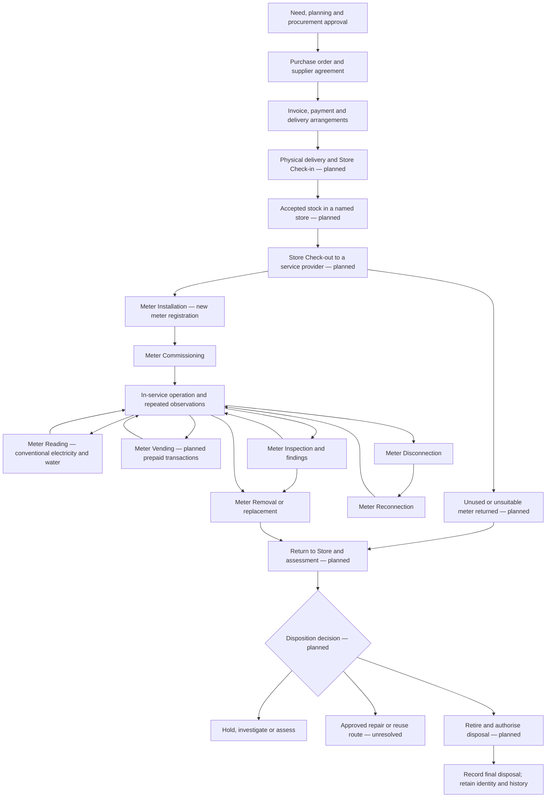
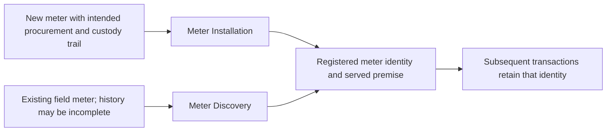
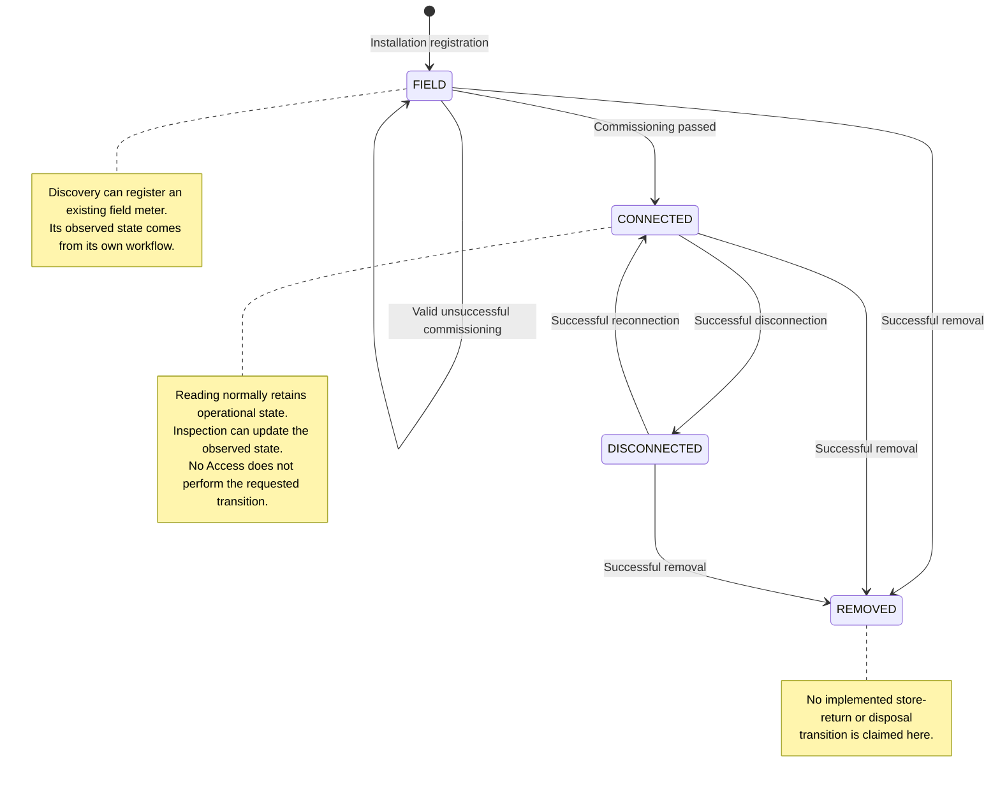
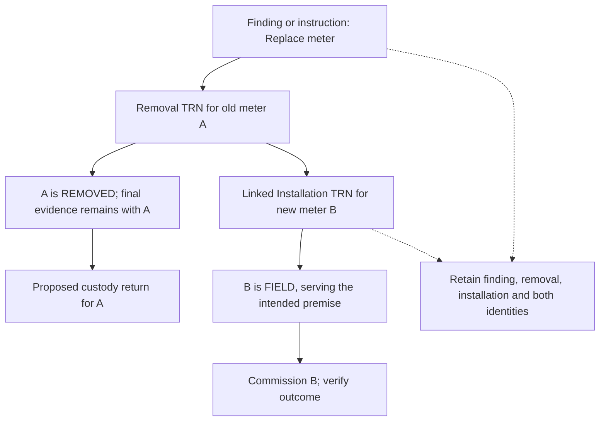

# Meter Lifecycle — Body of Knowledge

Module **MLC** · Version **0.1** · **25 September 2026** · Academy review draft.

The meter lifecycle is the complete history of a physical meter: why it was acquired, how custody moved, where it was installed, how its service was observed and managed, and what happened when it left service. It provides the organising chapter for the [form library](forms-library.md). A lifecycle stage can exist as a business process before iREPS has a form for it.

This chapter combines **owner direction** with **observed source behaviour**. Procurement, physical stores, retirement/disposal and vending are proposed coverage; they are not presented as deployed iREPS modules. Operational source is recorded in the [25 September source baseline](../00-academy-governance/FORMS_SOURCE_BASELINE_2026-09-25.csv). No live transaction or production acceptance test was performed for this chapter.

## 1. The central idea: one meter, many events

A meter remains the same physical asset as it moves from a supplier to a store, from a store to an installer, from an installer to a premise and later back to a store. Installing it does not give it a new serial. Removing it does not erase its past. Replacing it introduces a different physical meter with its own identity and history.

The meter measures or controls a service at a **served premise**. Its enclosure, room, pole or physical coordinates may be elsewhere. The land parcel supplies geographic context; the individual premise identifies the served unit; the account identifies a billing relationship. These must not collapse into one identity. A kiosk serving two ERFs is not a single meter or a single premise.

A transaction says what was requested, observed or done at a particular time. The asset record presents the current operational view. A work instruction says who should do something and its progress. A delivery note, invoice or payment record describes a different business event. Correctly linking these records is more useful than forcing all their meanings into one status word.

### The intended business flow

Solid arrows describe the owner's intended sequence and possible returns. They do **not** assert implemented automated transitions. Operational forms are named where source exists; upstream and end-of-life controls remain design work.

The owner described a purchase/payment/delivery sequence. The future design must also record the actual agreed commercial sequence: payment may occur before, with or after delivery under the applicable agreement. An invoice is not proof of payment, and payment is not proof that the meters arrived. This is a process model, not a prescribed accounting or procurement policy.

## 2. Starting before procurement

Procurement begins with a need: a new connection programme, failed meters, replacements, capacity requirements or stock replenishment. The responsible utility decides the service, meter kind, technical requirements, quantities, intended use and who can approve the acquisition. The Academy should teach why those facts matter before teaching a purchase form.

For example, a programme needs conventional water meters for a particular service. Receiving a box of prepaid electricity meters with a matching quantity does not satisfy that requirement. “Ten meters” is insufficient without the appropriate specification. Model, rating, units, compatibility and accessories need the owning engineering process; the Academy must not invent a universal acceptable specification.

The proposed procurement record should connect the requirement, approval, supplier and purchase-order lines. Quantities ordered, delivered, accepted, rejected, returned and outstanding should be separately explainable. If serials are not known when ordering, retain line-level quantities and establish individual identities when they become available. Do not generate fake serials merely to fill an early procurement record.

Read the [Meter Procurement package](meter-procurement-body-of-knowledge.md) for its proposed field definitions, workflow, exceptions and examples.

## 3. Commercial and delivery documents

The future process needs document relationships, not just a folder of photographs.

| Record | Question it answers | What it does not prove by itself |
| --- | --- | --- |
| Requirement and approval | Why are these meters needed, and who authorised the purchase? | That an order was placed or meters received |
| Purchase order | What was ordered, from whom and under which agreed terms? | That the supplier delivered every item |
| Supplier invoice | What amount is being requested for the supplied/contracted items? | That payment occurred or each serial was accepted |
| Payment evidence | What payment was made against the commercial obligation? | Physical receipt, acceptance, installation or commissioning |
| Delivery note | What shipment is said to have been delivered? | That the receiving person verified all contents and condition |
| Goods-received/check-in record | What physically arrived at which store, who checked it and what was accepted? | Fitness for issue if inspection or quarantine is outstanding |
| Discrepancy/return record | What was short, damaged, incorrect or returned and why? | That a credit, replacement shipment or financial adjustment is already complete |

“Delivery invoice” should not become an ambiguous synonym. During product discussion, identify whether the document is an invoice, delivery note, delivery receipt or another supplier document, and record its actual role. Final document labels and approval requirements remain to be agreed with the owning utility processes.

A source document should have a stable reference, issuer, date, related order/receipt, attachment where appropriate and an accountable actor. Corrections should preserve the original reference and explain the amendment. Supplier invoices and procurement payments are distinct from payments to field contractors based on accepted work, and from customer payments or vending purchases.

## 4. Physical receipt and Store Check-in

The utility may operate many stores. A meter being “in stock” is not enough to locate it. The proposed record should identify the utility, store, storage position where used, receiving person, time, source delivery/transfer and exact meter identities.

Receiving is a controlled comparison: what was expected, what arrived, what serials are present, what condition they are in and what disposition follows. A shortage, unexpected serial, duplicate serial, damaged casing or missing accessory must remain an exception rather than being made to match the order on paper.

Receipt and acceptance can be separate. A physically received damaged meter can remain in a holding area pending assessment. It should not automatically become available for installation. Proposed release/quarantine controls need approval; these are not current iREPS status codes.

Example: an order is for ten meters; nine arrive, one of those nine damaged. Record ten ordered, nine received, eight accepted for ordinary stock, one held and one outstanding. Avoid the two common errors: claiming ten in stock from the order quantity or erasing the damaged unit because it was not accepted for issue.

See [Store Check-in](store-receipt-body-of-knowledge.md). The application's software “Warehouse” or phone storage/cache terminology is not evidence of this physical stores module.

## 5. Store Check-out, dispatch and custody

Check-out records a deliberate issue of specific meters from a specific store. The recipient may be a main contractor, subcontractor, team or authorised individual acting for a provider. Organisation, person and custody are related but different facts: a fieldworker's employer does not prove that the worker received a particular serial.

The proposed issue record should connect an authorised request/job, available stock, the dispatched serials, issuing and receiving actors, issue time and intended destination or allocation. A recipient acknowledgement is evidence of handover, not installation. A meter can be in transit or held by an installer while still uninstalled.

Reconcile each dispatch into installed meters, unused returned meters, transferred custody and unresolved exceptions. A five-meter dispatch followed by three installations leaves two units requiring an explanation. Do not set all five to “in the field” merely because they left the store.

Inter-store transfer should be modelled as an issue from Store A and receipt at Store B with a linked transfer reference and any in-transit discrepancy. It must not create a second meter identity. Loss, damage in transit and receiver disagreement need explicit exception records and accountable follow-up.

See [Store Check-out](store-dispatch-body-of-knowledge.md). The owner intends this stage to precede installation. **The current inspected installation callable does not establish a verified store-issue prerequisite.** A future implementation must decide how to enforce it while accommodating existing meters, emergency work and historical imports.

## 6. Two ways a meter becomes registered in iREPS

### Meter Installation

[Meter Installation](meter-installation-body-of-knowledge.md) records installing a meter and registers its identity, service, served premise, technical characteristics, actual position and evidence. The inspected callable sets the new meter's operational state to `FIELD`. Commissioning remains separate.

Future procurement and store records should link to the installation by stable identity and issue reference. A valid installation should explain which physical unit was installed, where it serves, who installed it and which work it fulfils. A location outside the premise boundary does not change the served-premise association.

### Meter Discovery

[Meter Discovery](meter-discover-body-of-knowledge.md) registers a meter already found in the field. It is the essential entry for a utility adopting iREPS with an existing network. The discovery may be the first evidence iREPS holds even though the meter has operated for years.

Do not fabricate a purchase order, receipt, installation date or commissioning event to make this meter appear to have traversed every stage in the diagram. Record what is known, its evidence and its uncertainty. Recovered historical records can be linked later through an agreed process without pretending they were captured at the original event time.

Both are **registration forms**. Later inspection, reading, disconnection, reconnection and removal use an existing identity. A second registration is not the default remedy for a wrong serial or an uncertain submit. Identity correction, uniqueness collisions and their financial effects remain open product questions.

## 7. Commissioning and connection

[Meter Commissioning](meter-commissioning-body-of-knowledge.md) records whether the relevant readiness checks passed. The dedicated inspected validator accepts commissioning only for a `FIELD` meter of electricity or water service.

| Service / kind | Checks in the dedicated source | Successful outcome |
| --- | --- | --- |
| Electricity, prepaid | Vending confirmed; final switch-on confirmed; keypad issued, with applicable evidence | All checks pass: `CONNECTED` |
| Electricity, conventional | Final switch-on confirmed, with evidence | Check passes: `CONNECTED` |
| Water | Meter operational/service confirmed; reading or flow confirmed, with evidence | Both checks pass: `CONNECTED` |

A valid submission with a “no” answer and required notes can record unsuccessful commissioning. It is not the same as a server refusal for missing mandatory data. An unsuccessful commissioning result leaves `FIELD` under the inspected dedicated validator. A submitted form alone is therefore not evidence that the meter is connected.

This current implementation combines a successful commissioning result with the transition to `CONNECTED`. The wider lifecycle may discuss installation, commissioning approval and physical connection separately; no additional standalone initial-connection form was established in this investigation. **Meter Reconnection** has a different role: restoring a previously disconnected meter.

## 8. The operating life: repeated events

An operating meter can accumulate many readings, inspections and service interventions. These are a history, not a straight line with each form completed exactly once.

### Conventional readings and external billing

[Meter Reading](meter-reading-body-of-knowledge.md) records the observed register value, meter identity, capture time, position and proof. A regular reading interval makes comparison meaningful. A late submission must preserve the observation time rather than pretending the reading occurred when connectivity returned.

The inspected MREAD server rejects prepaid and token readings for its Sprint 1 scope, despite related phone branches. A no-reading reason or No Access is not a zero reading. A lower reading requires investigation: previous error, wrong register/meter, replacement, rollover or another supported explanation cannot be resolved by changing the entered value until it looks plausible.

[Reading staging and export](reading-staging-body-of-knowledge.md) prepares the reviewed population for an external billing system. Captured reading, prepared file, delivered file and accepted import are separate checkpoints. Full iREPS billing and automatic integration remain future work. The owner has explicitly said that meter reading still needs strengthening before production readiness.

### Prepaid vending

[Meter Vending](meter-vending-body-of-knowledge.md) is a planned purchase/transaction workflow. Distinguish payment acceptance, vending authorisation, token generation and token delivery. A lost response after payment needs reconciliation, not an automatic second charge. Commercial rules, units, integrations and reversal handling are not settled by this chapter.

The code names `METER_VENDING` but excludes it from the implemented generic lifecycle types. A commissioning “vending confirmed” answer and imported sales history do not constitute a token-purchase form.

### Inspection, findings and normalisation

[Meter Inspection](meter-inspection-body-of-knowledge.md) records the as-found condition, compares current values, identifies anomalies and records permitted work/follow-on needs. The inspected implementation can update the current asset view after confirmed differences, including observed Connected/Disconnected status. It preserves a distinction between the earlier transaction and the later observation.

This is not the planned QA module. A web supervisor's future pass/fail assessment of a submitted transaction still needs rules for correction, original evidence, duplicate identity and financial consequences. Inspection must not be taught as an unrestricted “edit any submitted form” mechanism.

### Disconnection and reconnection

[Meter Disconnection](meter-disconnection-body-of-knowledge.md) records completed interruption of supply; [Meter Reconnection](meter-reconnection-body-of-knowledge.md) records its restoration. Repeated cycles belong to the same meter history. An issued instruction or a No Access visit does not prove either physical outcome.

The usual observed transitions are `CONNECTED` → `DISCONNECTED` and `DISCONNECTED` → `CONNECTED`. A finding-linked disconnection exception exists in source for some already-disconnected records. Do not turn this into a general repeat-submit permission. Water-specific interpretation also needs review because the generic disconnection validator accepts water while its levels describe circuit-breaker work.

## 9. State, event, custody and work progress

The owner proposed words such as procured, checked in, checked out, in the field and removed. They express meaningful stages. Their final storage model is still open.

The Academy recommends discussing several dimensions instead of immediately introducing one large status enumeration:

| Dimension | Illustrative values/questions | Status of this model |
| --- | --- | --- |
| Acquisition | Ordered? Partially delivered? Accepted? Which PO? | Proposed procurement model |
| Physical location | Supplier, named store/bin, in transit, installed position, disposal destination | Proposed full model; field GPS exists |
| Custody | Which organisation/person is accountable now? Which handover proves it? | Proposed full stores/custody model |
| Operational asset state | `FIELD`, `CONNECTED`, `DISCONNECTED`, `REMOVED`; legacy `DECOMMISSIONED` guards also exist | Observed source values; not a complete approved lifecycle specification |
| Condition/disposition | Fit for issue, hold, investigation, repair candidate, retire/dispose decision | Proposed values, not runtime enums |
| Work progress | `ISSUED`, `REASSIGNED`, `ACCEPTED`, `REJECTED`, `IN_PROGRESS`, `COMPLETED`, `CANCELLED` | Observed lifecycle work-state vocabulary |
| Financial/document progress | Invoice received, payment recorded, work approval/payment status | Proposed integration; never infer from asset status alone |

A disconnected meter is usually still physically installed. A removed meter can be in transit, in a store or held as evidence. A checked-out meter might never have reached a premise. These examples explain why the dimensions matter. They are a design proposal, not an instruction to change the application's schema now.

### Operational transitions found in source

This diagram summarises the main outcomes, not the complete eligibility or permission model. See the form-specific validators for exceptions, access outcomes and branch differences.

The source contains edge cases requiring review: inspection allows `REMOVED` among eligible states; MREAD has its own state guards; older decommissioned values remain in guards. This chapter does not invent a tidy universal state machine by hiding those differences.

## 10. Removal, replacement and service continuity

[Meter Removal](meter-removal-body-of-knowledge.md) records removing the actual equipment. Capture the required final conventional reading or prepaid credit observation and its proof before it becomes unavailable. Remaining prepaid credit is not automatically consumption, cash or an authorised refund.

Removal success changes the old asset to `REMOVED` in the inspected implementation. It does not prove that it arrived at a store or that it was disposed of. If the meter could not be removed, do not confirm it as removed; use the appropriate finding or No Access outcome.

A replacement is a linked chain, not a rename:

The link must explain which premise/service is affected, which old meter left, which new meter arrived and when. There can be a gap between removal and replacement; do not conceal it by backdating a form. Readings before and after replacement belong to different meter registers and cannot simply be subtracted as if one continuous register existed.

## 11. Return, decommissioning, retirement and disposal

[Return to Store](store-return-body-of-knowledge.md) is a proposed custody event. It covers at least two different situations: unused issued stock returning, and previously installed equipment returning after removal. Record the reason and condition so they do not automatically share the same next action.

Returned equipment may require inspection, repair, investigation or retention as evidence. Physical possession does not establish fitness for reissue. Reuse of the same meter, movement to a different premise and recommissioning need explicit rules because current registration uniqueness can reject another registration of the same number. Do not solve this with a fabricated serial.

**Decommissioning** needs a product definition: does it record taking equipment out of service, an approval after physical removal, or another utility process? **Retirement** is the decision that the asset will no longer serve operationally. **Disposal** records its final authorised handling. These can occur at different times and must not silently be synonyms for Removal.

[Meter Retirement and Disposal](meter-disposal-body-of-knowledge.md) should link the decision authority, reason, physical outcome and inventory/asset reconciliation. Original identity, transactions and document references must remain available after disposal. The Academy does not prescribe a disposal method or delete retention evidence on the basis of this conceptual chapter.

## 12. Evidence, time and immutable history

For every proposed event, ask: which meter, which event, which prior reference, which person and organisation, which place, what observation/effective time, what server acceptance time, what evidence, and what result? Where these facts differ, preserve the difference rather than replacing the original capture time with a later upload time.

The future offline direction is to store every server-bound submission locally first, transmit when possible and reconcile the result. A 15-second attempt target has been discussed, but a timeout does not prove that server processing stopped. Current forms have differing draft/queue behaviour and local-retention rules; the common system is not complete.

For QA, the owner wants submitted evidence to remain trustworthy because payments, salaries and invoices can depend on it. Linked correction submissions are one possible design, not an approved implementation. A future correction must explain whether it changes the current asset view, operational acceptance, contractor payment eligibility or an already-paid amount. None of these consequences should be guessed by a learner or silently applied by documentation.

## 13. Worked end-to-end examples

### New conventional water meter

The utility orders ten water meters under TRAIN-PO01. Store A receives nine under TRAIN-DN01, accepts eight and holds one damaged unit. Serial `00123456789` is issued to Training Team A under TRAIN-ISS01. The installer verifies Premise TRAIN-P03, installs that serial and submits Meter Installation. The asset is `FIELD` in the observed implementation.

The commissioner records both required water checks with evidence. If both pass, the asset becomes `CONNECTED`. Later readings of 240.0 and 252.5, on the same verified register and unit, show a difference of 12.5 units. The reading workflow preserves dates and evidence; billing preparation still checks period, account and exceptions. Neither an installation nor a reading proves that a customer invoice was paid.

When removed, the final observation remains with that serial. A proposed return receipt records Store A's possession; a later disposition decision determines its next use. Procurement, issue and return references in this example are illustrative future records.

### Existing prepaid meter discovered during adoption

A fieldworker finds an operating prepaid meter serving Flat 2 in a shared kiosk outside its ERF. Procurement history is unavailable. The worker uses Meter Discovery, identifies Flat 2, captures the actual meter location and records the observed details. No historical installation or purchase date is invented.

An inspection later finds a changed seal and confirms a difference from Existing iREPS values. The new inspection becomes evidence for the current view; it does not erase the discovery. A later vending purchase belongs to the proposed vending module, not a fabricated current MREAD token workflow.

### Replacement followed by investigation

Meter A is removed under Replace meter and Meter B is installed on the same premise. A's final register and removal images remain with A; B's initial register and installation evidence remain with B. Commissioning determines B's ready-for-service outcome.

A is physically returned to Store B and held for investigation under the proposed stores process. Its removal, return, retirement decision and ultimate disposal may have different dates. A's history is retained even when the utility later disposes of it. B is not renamed to A, and no reading difference crosses their identities without an explicit billing adjustment process.

## 14. Decisions needed before implementing the full lifecycle

| Question | Why it matters | Current position |
| --- | --- | --- |
| When is an individual meter identity established before installation? | Purchase lines may precede known serials | Open |
| Which events require approval and which actors may perform them? | Responsibility differs across utility, main contractor and subcontractor | Action-specific permissions open |
| Which store/custody statuses and forms are canonical? | Prevent ambiguous check-in/check-out and duplicate stock | Proposed packages prepared |
| Must Installation have a valid store issue? How are exceptions handled? | Owner's intended sequence is not a verified current guard | Open |
| How do reuse and transfer preserve meter identity and service history? | Re-registration uniqueness and old service links can conflict | Open |
| What exactly constitutes decommissioning, retirement and disposal? | These are not automatically one event | Open terminology and transition decision |
| How are QA corrections, acceptance and paid work reconciled? | Original evidence and financial consequences must remain traceable | Planned QA, unresolved design |
| How are late responses, retries and successful phone records reconciled? | Avoid lost evidence and duplicate transactions | Common offline design incomplete |
| What release pair is accepted for each operational form? | Source branches can disagree or be undeployed | Named-environment validation required |

Use the [module inventory](../00-academy-governance/FORM_MODULE_INVENTORY.csv) to select the next detailed discussion. The [practical lifecycle scenarios](../10-assessments/meter-lifecycle-scenarios.md) provide a review checklist and expected explanations.
